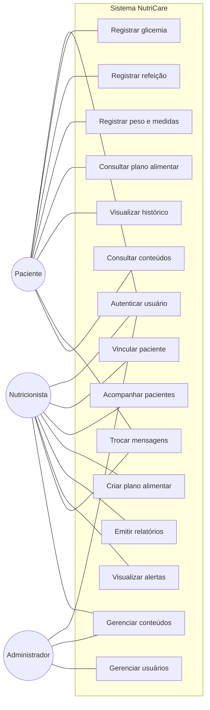
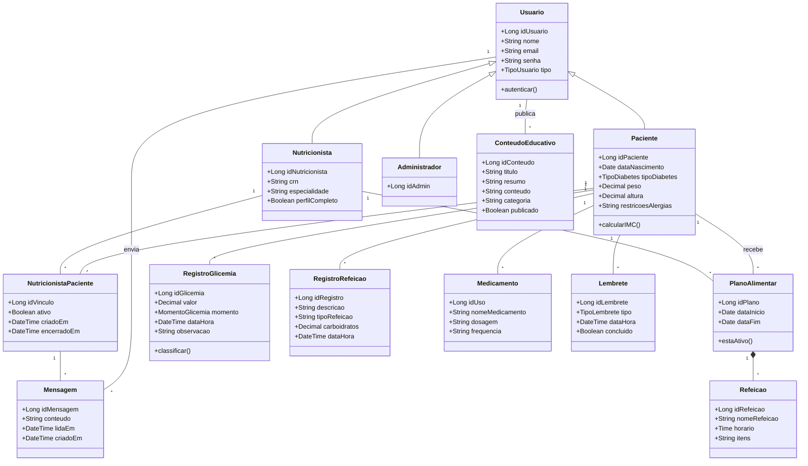
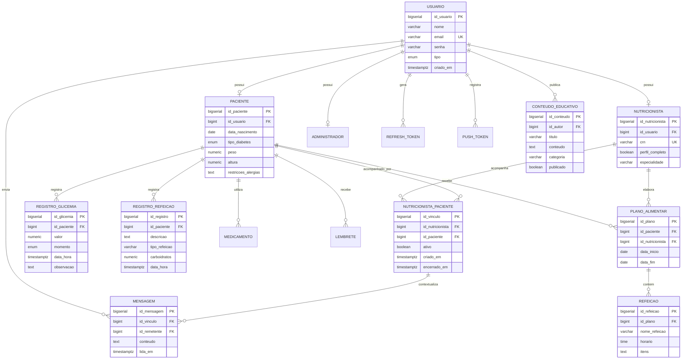
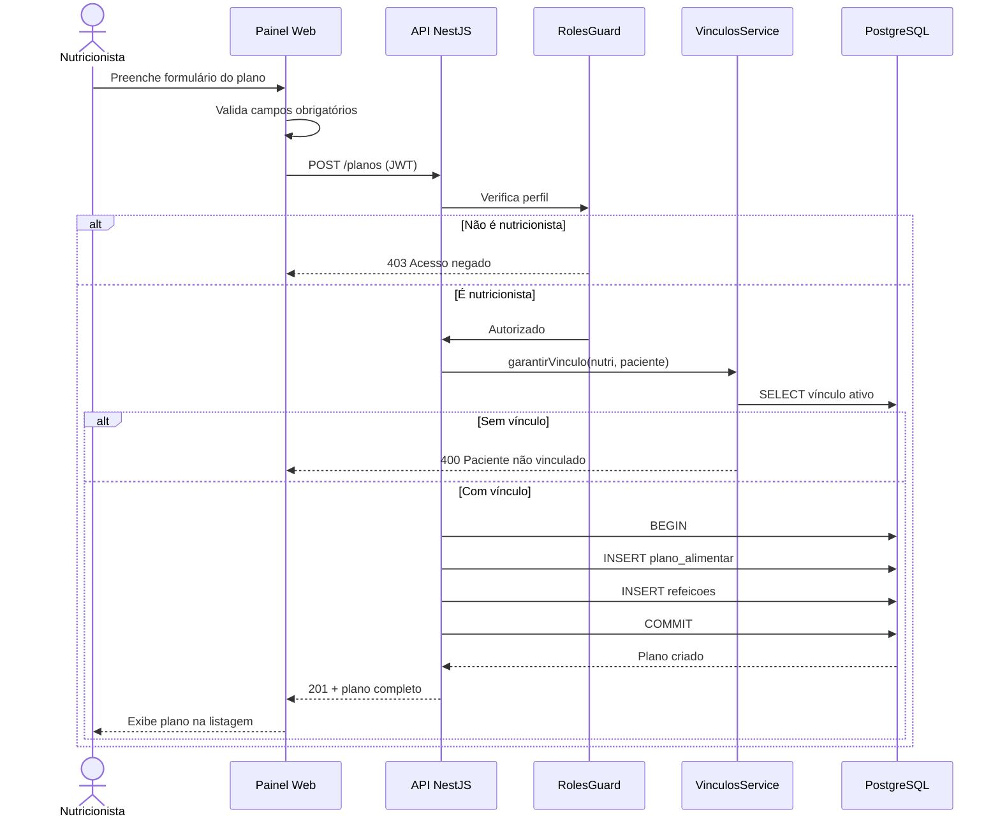
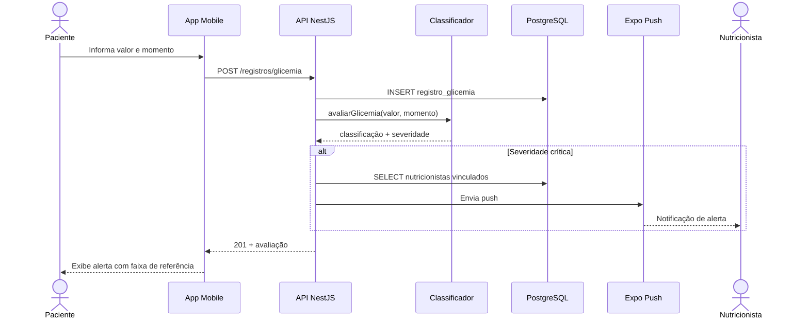
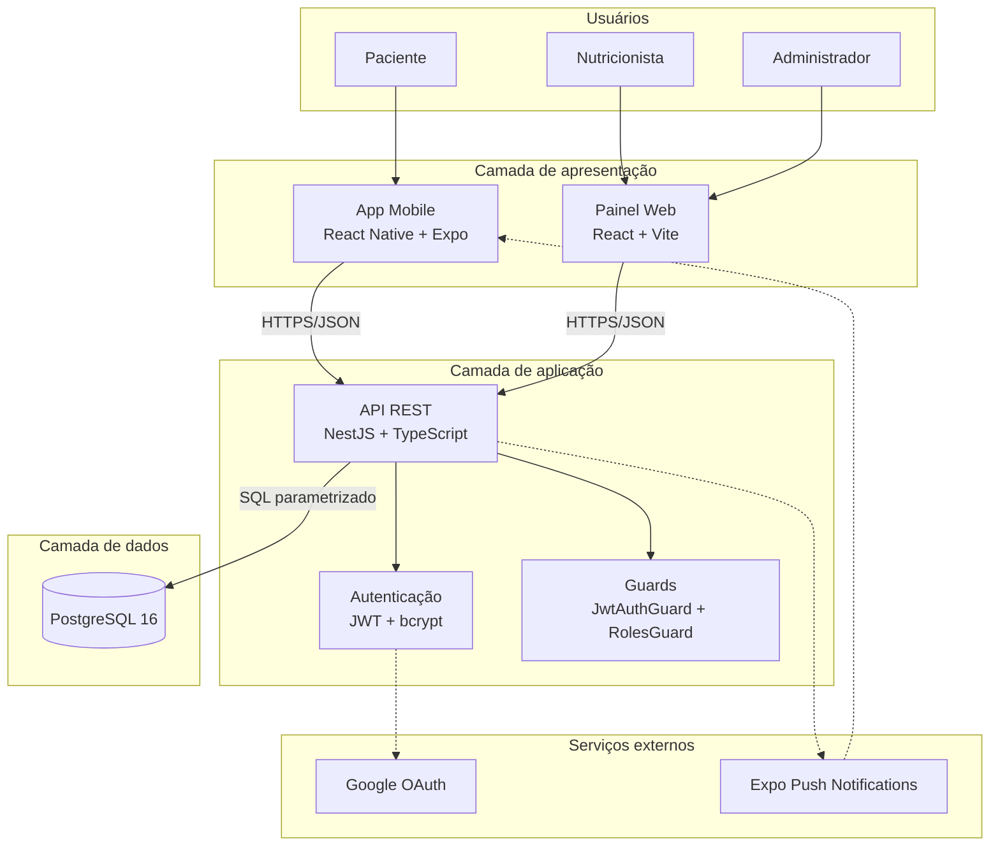
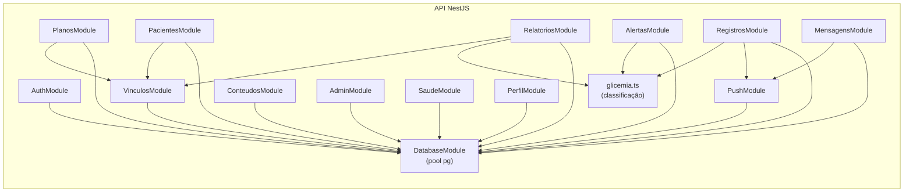

# Diagramas do sistema — NutriCare

Diagramas em Mermaid, renderizáveis no GitHub ou em https://mermaid.live
para exportar como imagem e inserir na monografia.

---

## 1. Casos de uso

---

## 2. Diagrama de classes

---

## 3. Modelo entidade-relacionamento

---

## 4. Diagrama de sequência — Criar plano alimentar

---

## 5. Diagrama de sequência — Registro de glicemia com alerta

---

## 6. Diagrama de containers

---

## 7. Diagrama de componentes da API

