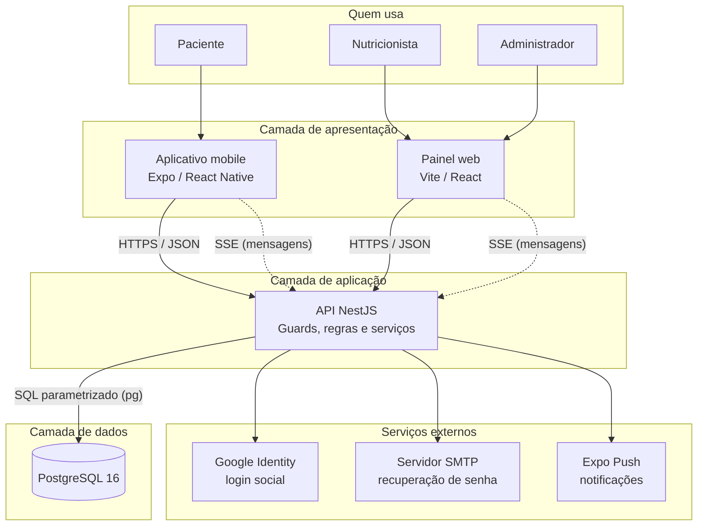
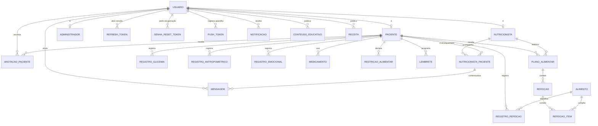
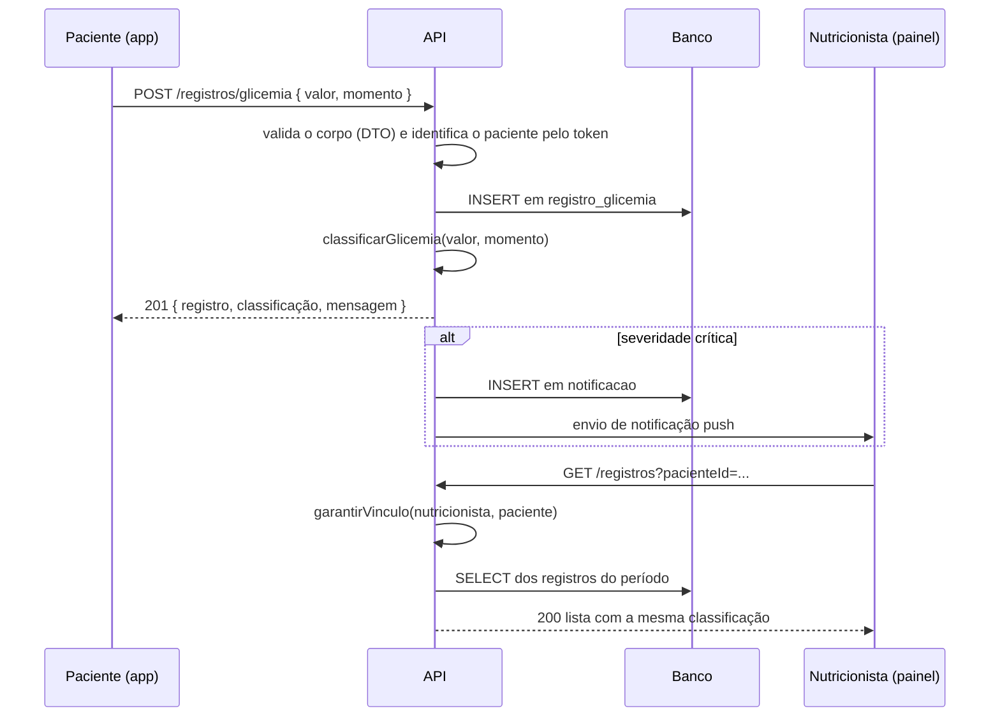
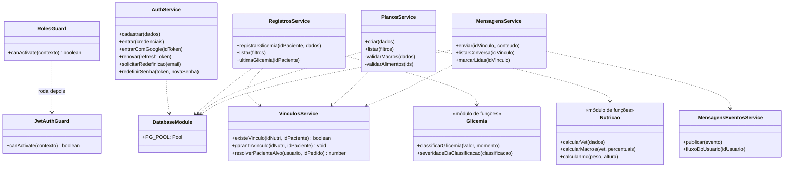
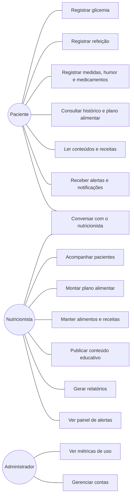

# NUTRICARE — SISTEMA DE APOIO AO CONTROLE NUTRICIONAL DE PESSOAS COM DIABETES

**Centro Universitário Católico Salesiano Auxilium — Araçatuba/SP**
**Curso de Tecnologia — Trabalho de Conclusão de Curso — 2026**

**Autores:** Natan Lourenço e Silva, Isac Buzelli dos Santos, Henrique Payá Ferreira
**Orientador:** Prof. Francisco Antônio de Souza
**Parceria:** Curso de Nutrição da instituição, com aplicação prevista na ADJ Birigui

> **Sobre a autoria.** O histórico do repositório registra commits de Isac Buzelli dos Santos
> (131), da conta de serviço "NutriCare Dev" (61) e de Natan Lourenço e Silva (6). Não há
> commits em nome de Henrique Payá Ferreira. A forma como cada autor participou precisa ser
> descrita pela equipe. **[PENDENTE DE CONFIRMAÇÃO]**

---

## SUMÁRIO

1. Introdução
2. Requisitos do sistema
3. Arquitetura do sistema
4. Banco de dados
5. Autenticação e controle de acesso
6. Telas do sistema
7. Funcionalidades de acompanhamento
8. Tecnologias utilizadas
9. Segurança e qualidade
10. Processo de desenvolvimento
11. Interface e experiência de uso
12. Resultados e conclusão
13. Referências
14. Apêndices e figuras

---

### Como ler este documento

Tudo o que está descrito aqui foi conferido no código-fonte, no banco de dados ou nos arquivos
de configuração do projeto, na versão de 30 de agosto de 2026. Quando uma informação não pôde
ser verificada, ela aparece marcada como **[PENDENTE DE CONFIRMAÇÃO]**, com a explicação do que
falta para confirmá-la. Nenhuma funcionalidade foi descrita a partir apenas de documentos
anteriores.

As figuras citadas ao longo do texto ainda precisam ser capturadas pelos autores: o projeto,
no estado atual, não contém nenhum arquivo de imagem. A lista completa está no capítulo 14.

---

# 1 INTRODUÇÃO

## 1.1 Contextualização

O diabetes é uma condição crônica que exige acompanhamento contínuo. Quem convive com ela
precisa medir a glicemia várias vezes ao dia, anotar o que comeu, controlar o peso e seguir
orientações alimentares que mudam conforme os resultados aparecem. Boa parte desse
acompanhamento acontece fora do consultório, e é aí que os dados costumam se perder: anotações
em papel, medições esquecidas, refeições registradas de memória na véspera da consulta.

Do outro lado, o profissional de nutrição chega à consulta com pouca informação sobre o que
aconteceu entre um atendimento e outro. As decisões acabam sendo tomadas com base no relato do
paciente, que é sempre parcial.

O NutriCare foi construído para preencher esse intervalo. É um sistema formado por três partes
que conversam entre si: um aplicativo de celular, usado pelo paciente para registrar o dia a
dia; um painel na internet, usado pelo nutricionista para acompanhar seus pacientes e montar
o plano alimentar; e um servidor que guarda os dados e aplica as regras.

O projeto foi desenvolvido em parceria com o curso de Nutrição da instituição, com aplicação
prevista na ADJ Birigui.

## 1.2 Problema

O acompanhamento nutricional de pessoas com diabetes esbarra em três dificuldades práticas:

**O registro é trabalhoso e se perde.** Anotar glicemia e refeições em papel dá trabalho e
depende de o paciente lembrar de levar o caderno à consulta. Quando a anotação falha, o
histórico fica com buracos justamente nos períodos em que algo saiu do controle.

**O profissional só enxerga o paciente na consulta.** Entre um atendimento e outro, não há como
saber que a glicemia esteve alta por vários dias seguidos. A conduta é sempre corretiva, nunca
preventiva.

**O paciente não recebe retorno imediato.** Ao medir 240 mg/dL, ele vê um número. Sem uma
referência clara para aquele momento do dia, o número sozinho diz pouco, e a decisão de procurar
ajuda fica sem apoio.

O problema que este trabalho endereça, portanto, é: **como aproximar o registro diário do
paciente do acompanhamento feito pelo profissional, de forma que os dois lados enxerguem a
mesma informação, no mesmo momento?**

## 1.3 Justificativa

Existem aplicativos de registro de glicemia e existem sistemas de prontuário para clínicas.
O que costuma faltar é a ligação entre os dois: o dado que o paciente registra raramente chega
ao profissional em tempo de mudar alguma coisa.

O NutriCare foi pensado para essa ligação. O paciente registra no celular; o dado vai para o
servidor; o nutricionista vê no painel, com a classificação já aplicada. Quando uma medição é
grave, o profissional é avisado sem precisar abrir a tela.

Há também uma justificativa acadêmica. O projeto exercita, em um caso real, a construção de um
sistema com três frentes — aplicativo móvel, aplicação web e serviço de retaguarda —
compartilhando um mesmo banco de dados e uma mesma API, com controle de acesso por perfil e
tratamento de dados de saúde, que a legislação classifica como sensíveis.

## 1.4 Objetivo geral

Desenvolver um sistema que integre o registro diário feito pelo paciente com diabetes ao
acompanhamento realizado pelo nutricionista, permitindo que ambos trabalhem sobre a mesma
informação.

## 1.5 Objetivos específicos

1. Permitir que o paciente registre glicemia, refeições, medidas corporais, medicamentos,
   restrições alimentares e estado emocional pelo celular.
2. Classificar automaticamente cada medição de glicemia conforme o momento do dia em que foi
   feita, devolvendo ao paciente uma resposta compreensível.
3. Avisar o paciente, no próprio aparelho, quando uma medição sair da faixa esperada.
4. Avisar o nutricionista quando um de seus pacientes registrar uma medição grave.
5. Oferecer ao nutricionista um painel com a lista de seus pacientes, o histórico de cada um e
   um resumo dos alertas do período.
6. Permitir a montagem de plano alimentar com cálculo da necessidade energética diária e da
   distribuição de macronutrientes.
7. Disponibilizar uma tabela nutricional de alimentos consultável na montagem do plano.
8. Permitir a troca de mensagens entre paciente e nutricionista dentro do sistema.
9. Permitir a publicação de conteúdo educativo e de receitas pelo profissional, com leitura
   pelo paciente no aplicativo.
10. Gerar relatórios do paciente, exportáveis em planilha e em PDF.
11. Garantir que cada nutricionista acesse apenas os dados dos pacientes sob seus cuidados.

## 1.6 Público-alvo

**Pacientes com diabetes**, de qualquer tipo, que façam acompanhamento nutricional. O sistema
não pressupõe familiaridade com tecnologia: o aplicativo tem um modo de interface simplificada,
com textos e alvos de toque maiores, aplicado automaticamente para quem tem 55 anos ou mais.

**Nutricionistas** que acompanham esses pacientes, no consultório ou em programas de atenção à
saúde. O painel foi desenhado para uso em computador, com adaptação para telas menores.

**Administração da instituição**, responsável por gerir contas e acompanhar números gerais do
sistema.

O cenário de aplicação previsto é a ADJ Birigui, em parceria com o curso de Nutrição.

## 1.7 Escopo do sistema

**Está no escopo:**

- Cadastro e autenticação de pacientes, nutricionistas e administradores.
- Registro e histórico de glicemia, refeições, medidas corporais, estado emocional,
  medicamentos e restrições alimentares.
- Classificação automática da glicemia por momento do dia, com alerta ao paciente e ao
  profissional.
- Vínculo profissional entre nutricionista e paciente, com controle de acesso baseado nele.
- Montagem de plano alimentar, com cálculo de necessidade energética e macronutrientes.
- Tabela nutricional de alimentos.
- Repositório de receitas e de conteúdo educativo.
- Troca de mensagens entre paciente e nutricionista.
- Relatórios do paciente com exportação em planilha e em PDF.
- Painel administrativo com métricas e gestão de usuários.

**Está fora do escopo:**

- Prescrição de medicamentos e qualquer conduta clínica automatizada.
- Integração com glicosímetros, balanças ou outros aparelhos.
- Integração com sistemas de prontuário eletrônico de terceiros.
- Agendamento de consultas e cobrança.
- Uso do sistema com pacientes reais antes da validação clínica dos parâmetros
  (ver seção 1.8).

## 1.8 Limitações do projeto

Estas limitações foram verificadas no código e valem para a versão descrita neste documento.

**1. Os parâmetros clínicos ainda não foram validados.** As faixas de referência de glicemia,
as fórmulas de necessidade energética e a distribuição de macronutrientes usadas pelo sistema
são referências gerais. O documento `docs/CONFERENCIA_NUTRICAO.md`, preparado para a conferência
pela equipe de Nutrição, está com o bloco de assinatura em branco. Os 36 alimentos carregados
no banco estão gravados com origem `exemplo`. **O sistema não deve ser usado com pacientes
reais enquanto essa validação não ocorrer.**

**2. O vínculo entre nutricionista e paciente é automático.** Ao se cadastrar, o paciente é
vinculado a todos os nutricionistas já registrados no sistema. Não existe pedido de
consentimento. Para o uso em produção com dados reais, isso precisa virar uma solicitação que o
paciente aceita.

**3. O registro profissional não é verificado.** O CRN é digitado livremente no cadastro do
nutricionista e não é conferido junto ao conselho, porque não há consulta pública automatizada.
A solução prevista é a aprovação manual de cada profissional pela administração.

**4. Os lembretes não têm tela.** A funcionalidade existe inteira no servidor — tabela, rotas e
testes — mas nem o aplicativo nem o painel oferecem tela para criar um lembrete.

**5. Há poucos gráficos.** O painel tem um único gráfico, na tela inicial, mostrando a evolução
diária dos alertas. Não existe gráfico de evolução da glicemia nem do peso em tela alcançável, e
o aplicativo não tem gráfico nenhum.

**6. Parte do painel web ficou inalcançável.** Cerca de 1.643 linhas de código do painel — entre
elas a tela de saúde do paciente, o componente de gráfico de linha e os formulários web de
medidas corporais e medicamentos — não são referenciadas por nenhuma rota. O código existe, mas
nenhum usuário consegue abri-lo.

**7. Não há testes automatizados no front-end.** A API tem 168 testes automatizados; o
aplicativo e o painel não têm nenhum. A conferência dessas duas partes é feita manualmente e por
um teste de fumaça que percorre as telas principais.

**8. O ambiente publicado é de demonstração.** O sistema está no ar em um plano gratuito, no
qual o servidor hiberna quando fica ocioso — a primeira requisição depois disso leva cerca de
50 segundos — e o banco de dados expira em 30 dias.

**9. No painel, a sessão fica guardada no armazenamento local do navegador.** É a solução mais
simples, mas expõe o token caso alguma falha de injeção de script apareça. A alternativa
(cookie com marcação `HttpOnly`) exigiria mudar o fluxo de autenticação.

---

# 2 REQUISITOS DO SISTEMA

## 2.1 Requisitos funcionais

A situação de cada requisito foi conferida no código. "Implementado" significa que existe rota
na API, tela no aplicativo ou no painel, e persistência no banco.

| Código | Requisito | Situação |
|---|---|---|
| RF01 | Cadastro e autenticação de paciente, nutricionista e administrador | Implementado |
| RF02 | Autenticação pela conta Google | Implementado no painel; implementado no aplicativo, com ressalva **[PENDENTE DE CONFIRMAÇÃO]** (ver 5.3) |
| RF03 | Recuperação de senha por e-mail | Implementado |
| RF04 | Registro de glicemia com momento do dia e observação | Implementado |
| RF05 | Classificação automática da glicemia e retorno ao paciente | Implementado |
| RF06 | Histórico de glicemia com filtro por período | Implementado |
| RF07 | Registro de refeições, com vínculo opcional a um alimento da tabela | Implementado |
| RF08 | Registro e histórico de medidas corporais, com IMC calculado | Implementado |
| RF09 | Registro de circunferências (cintura, quadril, braço, panturrilha, pescoço) | Implementado |
| RF10 | Registro do estado emocional em escala de cinco pontos | Implementado |
| RF11 | Cadastro de medicamentos em uso | Implementado |
| RF12 | Cadastro de restrições alimentares | Implementado |
| RF13 | Tabela nutricional de alimentos, consultável e editável pelo profissional | Implementado |
| RF14 | Cálculo da necessidade energética diária (VET) | Implementado |
| RF15 | Cálculo da distribuição de macronutrientes | Implementado |
| RF16 | Montagem, edição e encerramento de plano alimentar | Implementado |
| RF17 | Leitura do plano alimentar pelo paciente | Implementado |
| RF18 | Vínculo entre nutricionista e paciente | Implementado |
| RF19 | Alerta ao paciente quando a medição sai da faixa | Implementado |
| RF20 | Alerta ao nutricionista quando a medição do paciente é grave | Implementado |
| RF21 | Painel de alertas do período, com ranking por paciente | Implementado |
| RF22 | Troca de mensagens entre paciente e nutricionista, em tempo real | Implementado |
| RF23 | Publicação e leitura de conteúdo educativo | Implementado |
| RF24 | Publicação e leitura de receitas | Implementado |
| RF25 | Anotações do profissional sobre o paciente | Implementado |
| RF26 | Relatório do paciente, com exportação em planilha e em PDF | Implementado |
| RF27 | Métricas gerais e gestão de usuários pelo administrador | Implementado |
| RF28 | Exclusão da própria conta pelo paciente | Implementado |
| RF29 | Lembretes programáveis pelo paciente | **Parcial** — existe na API e no banco; não existe tela |
| RF30 | Gráficos de evolução da glicemia e do peso | **Não implementado** — só existe o gráfico de alertas |

### Comparação com o briefing da equipe de Nutrição

O briefing recebido do curso de Nutrição trazia dez requisitos. A situação atual de cada um:

| Nº do briefing | Requisito | Situação em 30/08/2026 |
|---|---|---|
| 1 | Tabela de alimentos com valores nutricionais | Atendido na estrutura; os 36 itens carregados são exemplos e precisam ser trocados pela tabela oficial |
| 2 | Cálculo da necessidade energética diária | Atendido (Mifflin-St Jeor e Harris-Benedict) — a fórmula a adotar ainda depende de definição clínica |
| 3 | Distribuição de macronutrientes no plano | Atendido — os percentuais padrão ainda dependem de definição clínica |
| 4 | Peso, altura, IMC e circunferências, com histórico | Atendido |
| 5 | Registro e histórico de glicemia com gráfico | Registro e histórico atendidos; **falta o gráfico** |
| 6 | Registro emocional do paciente | Atendido, em escala de cinco pontos com fatores em texto livre |
| 7 | Alertas e lembretes configuráveis | Alertas atendidos; **lembretes sem tela** |
| 8 | Visualização dos indicadores em gráficos | **Não atendido**, exceto o gráfico de alertas |
| 9 | Repositório de receitas e orientações | Atendido |
| 10 | Controle de acesso por perfil | Atendido |

Sete dos dez requisitos estão atendidos, um está atendido em parte e dois não estão. Os três
pontos em aberto são os gráficos, os lembretes e a substituição da tabela de alimentos de
exemplo pela tabela oficial.

## 2.2 Requisitos não funcionais

| Código | Requisito | Como é atendido |
|---|---|---|
| RNF01 | As senhas não podem ser guardadas em texto legível | Hash bcrypt com custo 10 |
| RNF02 | A sessão precisa expirar | Token de acesso com 15 minutos; refresh token com 30 dias e rotação a cada uso |
| RNF03 | Cada profissional só acessa os dados dos seus pacientes | Verificação de vínculo no servidor, centralizada em `VinculosService` |
| RNF04 | Toda entrada precisa ser validada antes de chegar ao banco | DTOs com `class-validator` e `ValidationPipe` global com `whitelist` |
| RNF05 | O sistema não pode ser vulnerável a injeção de SQL | Todas as consultas usam parâmetros (`$1`, `$2`), sem concatenação de texto |
| RNF06 | O aplicativo precisa guardar o token com segurança | `expo-secure-store`, que usa o cofre do sistema operacional |
| RNF07 | O sistema precisa funcionar em celular e em computador | Aplicativo nativo para o paciente; painel responsivo para o profissional |
| RNF08 | A interface precisa ser usável por pessoas com pouca familiaridade com tecnologia | Modo simplificado automático a partir dos 55 anos |
| RNF09 | Mensagem nova precisa aparecer sem recarregar a tela | Canal SSE aberto entre o navegador/aplicativo e o servidor |
| RNF10 | O sistema precisa ter uma sonda de disponibilidade | Rotas `/status` e `/health`, sem autenticação e sem dado de paciente |
| RNF11 | As regras clínicas precisam estar em um lugar só | Concentradas em `common/glicemia/glicemia.ts` e `common/nutricao/nutricao.ts` |
| RNF12 | Alterações no banco precisam ser reproduzíveis | Migrations numeradas e tabela de controle `migracao_aplicada` |
| RNF13 | O código precisa ter cobertura automatizada na camada de regras | 168 testes automatizados na API |

## 2.3 Regras de negócio

| Código | Regra | Onde é aplicada |
|---|---|---|
| RN01 | Um nutricionista só acessa dados de pacientes com vínculo ativo | `VinculosService.garantirVinculo` |
| RN02 | Um paciente só acessa os próprios dados; um identificador de paciente enviado por ele é ignorado | `VinculosService.resolverPacienteAlvo` |
| RN03 | Só pode existir um vínculo ativo por par nutricionista/paciente | Índice único parcial `idx_vinculo_ativo_unico`; conflito devolve erro 409 |
| RN04 | Desvincular não apaga o histórico: marca o vínculo como encerrado | `desvincular` grava `ativo = FALSE` e `encerrado_em` |
| RN05 | A glicemia é classificada pelo valor e pelo momento do dia | `classificarGlicemia`, em `common/glicemia/glicemia.ts` |
| RN06 | Abaixo de 54 mg/dL ou acima de 250 mg/dL o alerta é crítico, em qualquer momento | Constantes `LIMITE_HIPO_GRAVE` e `LIMITE_HIPER_GRAVE` |
| RN07 | Uma medição crítica notifica os nutricionistas vinculados ao paciente | `registros.service.ts`, ao gravar a glicemia |
| RN08 | Os percentuais de macronutrientes vêm os três juntos e somam 100, ou nenhum vem | CHECK `chk_plano_macros_100` no banco e validação equivalente no serviço |
| RN09 | A data final do plano não pode ser anterior à data inicial | CHECK na tabela e validação no serviço |
| RN10 | O IMC nunca é gravado à mão: é calculado a partir do peso e da altura | Coluna gerada `imc` em `registro_antropometrico` |
| RN11 | Um lembrete de glicemia não aponta para medição alguma | CHECK `chk_lembrete_vinculo` |
| RN12 | Um lembrete recorrente exige horário; um lembrete avulso exige data e hora | CHECK `chk_lembrete_quando` |
| RN13 | O administrador não pode excluir a própria conta nem o último administrador | `admin.service.ts` |
| RN14 | O paciente só entra pelo aplicativo; o painel é para nutricionista e administrador | `LoginPage.tsx` recusa o perfil paciente com mensagem explicativa |
| RN15 | Um token de recuperação de senha vale uma hora e só pode ser usado uma vez | Tabela `senha_reset_token`, com consumo em transação |
| RN16 | Conta desativada não faz login | Verificação de `usuario.desativado_em` |
| RN17 | Ao se cadastrar, o paciente é vinculado automaticamente a todos os nutricionistas existentes | `auth.service.ts` — ver limitação 2 da seção 1.8 |

## 2.4 Tipos de usuário e permissões

O sistema tem três perfis, gravados no campo `usuario.tipo` como um tipo enumerado do banco.

**Paciente.** Acessa o sistema pelo aplicativo. Registra e consulta os próprios dados de
glicemia, refeições, medidas, humor, medicamentos e restrições. Lê o plano alimentar montado
para ele, as receitas e o conteúdo educativo publicados. Conversa com o nutricionista. Pode
editar o próprio perfil, trocar a senha e excluir a conta. **Não vê dados de outro paciente em
nenhuma circunstância** — o servidor ignora qualquer identificador de paciente que venha em uma
requisição feita por um paciente.

**Nutricionista.** Acessa o sistema pelo painel web. Vê a lista dos pacientes com vínculo ativo,
o histórico de cada um, e os alertas do período. Monta e edita planos alimentares, cadastra
alimentos na tabela nutricional, publica receitas e conteúdo educativo, registra anotações sobre
o paciente, gera relatórios e conversa com o paciente. **Para acessar qualquer dado de saúde,
precisa informar de qual paciente se trata, e o servidor confere o vínculo antes de responder.**

**Administrador.** Acessa o painel web, na área `/admin`. Vê as métricas gerais do sistema
(quantidade de pacientes, nutricionistas, vínculos ativos, registros no período) e a lista de
usuários, podendo remover contas. **Não tem acesso aos dados de saúde de nenhum paciente**: o
servidor recusa explicitamente a tentativa, com erro 403.

O quadro abaixo resume o que cada perfil pode fazer.

| Ação | Paciente | Nutricionista | Administrador |
|---|:---:|:---:|:---:|
| Registrar glicemia, refeição, medidas, humor | ✔ (só os próprios) | — | — |
| Consultar dados de saúde de um paciente | ✔ (só os próprios) | ✔ (só vinculados) | ✘ (bloqueado) |
| Criar e editar plano alimentar | — | ✔ | — |
| Ler o plano alimentar | ✔ | ✔ | — |
| Cadastrar alimento na tabela nutricional | — | ✔ | ✔ |
| Publicar receita e conteúdo educativo | — | ✔ | ✔ |
| Ler receita e conteúdo educativo | ✔ | ✔ | ✔ |
| Trocar mensagens | ✔ | ✔ | — |
| Criar e encerrar vínculo | — | ✔ | — |
| Gerar relatório do paciente | — | ✔ | — |
| Ver métricas do sistema | — | — | ✔ |
| Remover usuários | — | — | ✔ |
| Excluir a própria conta | ✔ | — | — |
---

# 3 ARQUITETURA DO SISTEMA

## 3.1 Visão geral

O NutriCare é dividido em quatro peças, com responsabilidades separadas:

1. **Aplicativo mobile** — usado pelo paciente. Não conversa com o banco de dados; só fala com
   a API.
2. **Painel web** — usado pelo nutricionista e pelo administrador. Também só fala com a API.
3. **API (backend)** — recebe as requisições das duas interfaces, verifica quem está pedindo,
   aplica as regras e é a única peça que acessa o banco.
4. **Banco de dados PostgreSQL** — guarda tudo.

O caminho do dado é sempre o mesmo, nos dois sentidos:

    Aplicativo mobile  →  API  →  Banco de dados
    Painel web         →  API  →  Banco de dados

Nenhuma interface acessa o banco diretamente. Isso é o que permite que a regra clínica —
por exemplo, a classificação de uma glicemia — exista em um lugar só e valha igualmente para
quem usa o celular e para quem usa o navegador.



**Figura 22 – Arquitetura em camadas do sistema NutriCare.**
*Fonte: Elaborado pelos autores (2026).*

O diagrama mostra as quatro camadas e os três serviços externos de que o sistema depende. As
linhas cheias são requisições comuns; as tracejadas são o canal de mensagens em tempo real, que
fica aberto enquanto a tela estiver em uso. Repare que nenhuma seta liga a camada de
apresentação diretamente ao banco.

## 3.2 Funcionamento do painel web

O painel fica em `apps/web` e é uma aplicação de página única, construída com
Vite 5 e React 18, escrita em TypeScript. A navegação é feita pelo `react-router-dom`, e as
chamadas à API pelo `axios`.

**Estrutura de pastas:**

| Pasta | Conteúdo |
|---|---|
| `src/pages/auth` | Login, cadastro, esqueci a senha, redefinir senha |
| `src/pages/app` | Telas internas: início, pacientes, acompanhamento, alimentação, alimentos, receitas, relatórios, mensagens, conteúdos, administração, perfil |
| `src/components` | Componentes reutilizados: cartões, campos, modais, seletor de paciente, central de notificações |
| `src/components/layout` | O esqueleto da aplicação, com o menu lateral |
| `src/contexts` | `AuthContext`, que guarda a sessão e distribui o usuário logado |
| `src/lib` | Cliente HTTP, tipos e utilitários |

**Como a sessão é mantida.** Depois do login, o `AuthContext` guarda o usuário, o token de
acesso e o refresh token no armazenamento local do navegador. O cliente HTTP tem um
interceptador que, ao receber a resposta 401, tenta renovar o token uma única vez — mesmo que
várias telas peçam dados ao mesmo tempo — e refaz a requisição original. Se a renovação falhar,
a sessão é limpa e o usuário volta para a tela de login.

**Como as rotas são protegidas.** Toda rota interna passa por um componente `ProtectedRoute`,
que redireciona para o login quem não estiver autenticado. Depois do login, o destino depende do
perfil: administrador vai para `/admin` e nutricionista vai para `/inicio`.

> **Detalhe de implantação.** A tela inicial fica em `/inicio` e não em `/dashboard` porque o
> serviço de hospedagem usado reserva esse caminho e devolve erro 404. A rota `/dashboard`
> continua existindo, redirecionando para `/inicio`, para não quebrar links antigos.

**Estilos.** O painel usa CSS Modules e um conjunto de variáveis CSS para cores, espaçamentos e
tipografia. Não há biblioteca de componentes prontos nem biblioteca de gráficos: o único gráfico
existente foi escrito diretamente em SVG.

## 3.3 Funcionamento do aplicativo mobile

O aplicativo fica em `apps/mobile` e é construído com Expo 54, React Native 0.81 e React 19,
em TypeScript.

**Navegação.** É feita pelo `expo-router`, que monta as rotas a partir da estrutura de pastas.
São três grupos:

| Grupo | Telas |
|---|---|
| `(auth)` | Abertura, login, login do cliente, cadastro, esqueci a senha |
| `onboarding` | Complemento do perfil do paciente após o primeiro acesso |
| `(tabs)` | Home, Registros, Alimentação, Saúde, Mensagens, Perfil |

Dentro das abas há as telas de detalhe: registro de glicemia, registro de refeição, plano
alimentar, receitas, conteúdos, restrições, medidas, humor, medicamentos, edição de perfil,
troca de senha e exclusão de conta. São 32 arquivos de tela ao todo.

**Estado e dados.** O `zustand` guarda a sessão; o `TanStack Query` cuida das chamadas à API,
do cache e da revalidação. Os formulários usam `react-hook-form` com validação por `zod`.

**Onde o token fica guardado.** No `expo-secure-store`, que usa o cofre do sistema operacional
(Keychain no iOS, Keystore no Android). É diferente do painel web, que usa o armazenamento local
do navegador, e é a opção mais segura das duas.

**Hooks próprios.** Cinco hooks concentram o comportamento que não é de tela:

- `use-auth` — sessão e perfil do usuário;
- `use-glycemic-watch` — dispara a notificação local quando a última medição está fora da faixa;
- `use-push-notifications` — registra o aparelho para receber notificações do servidor;
- `use-mensagens-realtime` — mantém a conexão SSE aberta e atualiza as conversas;
- `use-accessible-mode` — liga o modo simplificado a partir da idade do paciente.

## 3.4 Funcionamento do backend

A API fica em `apps/api` e usa NestJS 10 sobre Node.js, em TypeScript 5.6.

O NestJS organiza o código em **módulos**. Cada módulo reúne um controller (que recebe as
requisições HTTP), um service (onde ficam as regras) e os DTOs (que descrevem e validam o que
chega). São 26 módulos:

| Área | Módulos |
|---|---|
| Acesso | `auth`, `perfil`, `vinculos`, `pacientes` |
| Registros do paciente | `registros`, `saude`, `antropometria`, `emocional`, `medicamentos`, `restricoes`, `anotacoes` |
| Nutrição | `alimentos`, `receitas`, `planos`, `nutricional` |
| Comunicação | `mensagens`, `notificacoes`, `push`, `conteudos` |
| Apoio ao acompanhamento | `alertas`, `relatorios`, `lembretes` |
| Administração e operação | `admin`, `health`, `status`, `mail` |

**Como uma requisição é processada.** O caminho é sempre o mesmo:

1. O `ValidationPipe` global confere o corpo da requisição contra o DTO e descarta qualquer
   campo que não esteja declarado.
2. O `JwtAuthGuard` valida o token e coloca o usuário na requisição.
3. O `RolesGuard` confere se o perfil do usuário está entre os permitidos para aquela rota.
4. O service aplica a regra. Quando a rota envolve dados de um paciente, ele chama o
   `VinculosService` para resolver de qual paciente se trata e se quem pede tem direito.
5. A consulta ao banco é feita com SQL parametrizado, através de um pool de conexões `pg`.

**Regras clínicas em um lugar só.** Dois arquivos concentram tudo o que é cálculo ou
classificação:

- `common/glicemia/glicemia.ts` — limites, faixas por momento do dia, classificação, severidade
  e as mensagens mostradas ao paciente;
- `common/nutricao/nutricao.ts` — fórmulas de necessidade energética, fatores de atividade,
  cálculo de macronutrientes, IMC, relação cintura-quadril e conversão de porções.

Manter esses cálculos fora dos controllers é o que torna possível testá-los isoladamente — a
maior parte dos 168 testes automatizados incide sobre eles.

## 3.5 Funcionamento da API

A API é REST, troca JSON e usa autenticação por token no cabeçalho `Authorization: Bearer`.
São cerca de 90 rotas. A tabela abaixo lista as principais, agrupadas por finalidade.

**Acesso** (não exigem token, exceto onde indicado)

| Método | Rota | Para que serve |
|---|---|---|
| POST | `/auth/cadastro/paciente` | Cadastro de paciente |
| POST | `/auth/cadastro/nutricionista` | Cadastro de nutricionista |
| POST | `/auth/login` | Login por e-mail e senha |
| POST | `/auth/google/paciente` | Login pelo Google, a partir do aplicativo |
| POST | `/auth/google/nutricionista` | Login pelo Google, a partir do painel |
| POST | `/auth/refresh` | Troca o refresh token por um novo par de tokens |
| POST | `/auth/logout` | Revoga o refresh token |
| POST | `/auth/esqueci-senha` | Envia o e-mail de recuperação |
| POST | `/auth/redefinir-senha` | Grava a nova senha usando o token recebido |
| GET | `/auth/me` | Dados do usuário logado (exige token) |

**Perfil**

| Método | Rota | Para que serve |
|---|---|---|
| PATCH | `/perfil` | Atualiza nome e e-mail |
| GET/PATCH | `/perfil/paciente` | Lê e atualiza os dados clínicos do paciente |
| DELETE | `/perfil` | Desativa a própria conta (só paciente) |

**Registros do paciente**

| Método | Rota | Para que serve |
|---|---|---|
| POST | `/registros/glicemia` | Grava uma medição e devolve a classificação |
| POST | `/registros/refeicao` | Grava uma refeição |
| GET | `/registros` | Histórico, com filtro por tipo e período |
| GET | `/registros/glicemia/ultimo` | Última medição, com quantos minutos se passaram |
| GET/POST/DELETE | `/antropometria` | Medidas corporais e circunferências |
| GET | `/antropometria/evolucao` | Série histórica de peso e IMC |
| GET/POST/DELETE | `/emocional` | Registro emocional |
| GET | `/emocional/resumo` | Resumo do período |
| GET/POST/PATCH/DELETE | `/medicamentos` | Medicamentos em uso |
| GET/POST/PATCH/DELETE | `/restricoes` | Restrições alimentares |
| GET | `/saude/:pacienteId` | Painel consolidado de saúde do paciente |

**Nutrição**

| Método | Rota | Para que serve |
|---|---|---|
| GET | `/alimentos` | Busca na tabela nutricional |
| GET | `/alimentos/:id/porcao` | Valores recalculados para uma quantidade |
| POST/PATCH/DELETE | `/alimentos` | Manutenção da tabela (nutricionista e administrador) |
| GET | `/nutricional/referencias` | Fórmulas, fatores de atividade e distribuição padrão |
| POST | `/nutricional/calcular` | Calcula VET e macronutrientes |
| GET/POST/PATCH/DELETE | `/planos` | Planos alimentares |
| GET | `/planos/ativo` | Plano vigente do paciente |
| GET/POST/PATCH/DELETE | `/receitas` | Receitas |

**Acompanhamento e comunicação**

| Método | Rota | Para que serve |
|---|---|---|
| GET/POST/DELETE | `/vinculos` | Vincula e desvincula paciente (só nutricionista) |
| GET | `/pacientes` | Lista dos pacientes vinculados |
| GET | `/pacientes/disponiveis` | Pacientes ainda sem vínculo com este profissional |
| GET/POST | `/anotacoes` | Anotações do profissional sobre o paciente |
| GET | `/alertas` | Medições fora da faixa no período |
| GET | `/alertas/resumo` | Percentual dentro da faixa e ranking por paciente |
| GET | `/relatorios` | Relatório consolidado do paciente |
| GET | `/relatorios/csv` | O mesmo relatório em planilha |
| GET/POST | `/mensagens` | Conversas e envio de mensagem |
| GET | `/mensagens/stream` | **Canal SSE** de mensagens em tempo real |
| POST | `/mensagens/:id/digitando` | Sinal de "está digitando" |
| GET/POST/PATCH/DELETE | `/conteudos` | Conteúdo educativo |
| GET/PATCH/DELETE | `/notificacoes` | Notificações do usuário |
| POST/DELETE | `/push/token` | Registra e remove o aparelho para notificação |
| GET/POST/PATCH/DELETE | `/lembretes` | Lembretes — sem tela em nenhuma interface |

**Administração e operação**

| Método | Rota | Para que serve |
|---|---|---|
| GET | `/admin/metricas` | Números gerais do sistema |
| GET | `/admin/usuarios` | Lista de usuários |
| DELETE | `/admin/usuarios/:id` | Remove um usuário |
| GET | `/status` | Sonda simples de disponibilidade |
| GET | `/health` | Estado da API, do banco e do canal em tempo real |
| GET | `/health/live`, `/health/database`, `/health/ready` | Sondas específicas |

As rotas de `/status` e `/health` não exigem autenticação, de propósito: quem monitora o sistema
normalmente não tem sessão. Em compensação, elas devolvem apenas estado — nenhum dado de
paciente, nenhuma configuração, nenhuma string de conexão.

## 3.6 Integração entre as partes

O que amarra as três frentes é a API. Um mesmo registro de glicemia percorre este caminho:

1. O paciente abre a tela de registro no aplicativo e informa o valor e o momento do dia.
2. O aplicativo envia `POST /registros/glicemia` com o token no cabeçalho.
3. A API valida o corpo pelo DTO, identifica o paciente pelo token (ignorando qualquer
   identificador que venha no corpo) e grava na tabela `registro_glicemia`.
4. Ainda na mesma requisição, a API classifica a medição e devolve ao aplicativo a
   classificação e a mensagem correspondente, que aparece na tela na hora.
5. Se a classificação for grave, a API grava uma notificação e dispara o envio para os
   nutricionistas vinculados ao paciente.
6. Quando o nutricionista abre o acompanhamento daquele paciente no painel, o painel pede
   `GET /registros?pacienteId=...`; a API confere o vínculo e devolve o mesmo registro, com a
   mesma classificação.

O ponto importante é que a classificação é feita **uma vez só, no servidor**. O aplicativo e o
painel apenas exibem o resultado. Se a equipe de Nutrição mudar uma faixa de referência, a
mudança vale imediatamente para os dois, sem publicar nova versão do aplicativo.

---

# 4 BANCO DE DADOS

## 4.1 Tecnologia e organização

O banco é PostgreSQL 16. O acesso é feito pelo driver oficial `pg`, com um pool de conexões
compartilhado por todos os módulos da API. **Não é usado nenhum ORM** — a justificativa está na
seção 8.9.

Os arquivos ficam em `database/`:

| Arquivo | Conteúdo |
|---|---|
| `schema.sql` | Criação completa: 7 tipos enumerados, 24 tabelas, índices e triggers |
| `migrations/001` a `migrations/014` | Alterações incrementais, aplicadas em ordem |
| `seeds_admin.sql` | Administrador inicial |
| `seeds_alimentos.sql` | 36 alimentos de exemplo |
| `seeds.sql` | Dados fictícios de demonstração |

O script `apps/api/preparar-banco.mjs` prepara o banco e pode ser executado quantas vezes for
preciso: ele registra em uma tabela de controle (`migracao_aplicada`) o que já foi aplicado e
pula o resto. Isso é necessário porque o `schema.sql` cria tudo de uma vez, sem `IF NOT EXISTS`,
e rodá-lo duas vezes daria erro.

## 4.2 Tabelas, entidades e relacionamentos

São 24 tabelas. Só estão descritas aqui tabelas e campos que existem de fato no `schema.sql`
e nas migrations.

### Identidade e acesso

**`usuario`** — a conta. Guarda `nome`, `email` (único), `senha` (hash bcrypt), `tipo`
(paciente, nutricionista ou administrador) e `desativado_em`. Quando `desativado_em` está
preenchido, a conta existe mas não faz login — é a exclusão suave.

**`paciente`** — o perfil clínico, ligado um-para-um a `usuario`. Guarda data de nascimento,
gênero, tipo de diabetes, restrições em texto livre, peso, altura e nível de atividade.

**`nutricionista`** — o perfil profissional, também um-para-um com `usuario`. Guarda o CRN
(único, opcional no cadastro), a especialidade e a marca `perfil_completo`.

**`administrador`** — um-para-um com `usuario`. Só marca que aquela conta é administradora.

**`nutricionista_paciente`** — o vínculo. É a tabela que sustenta todo o controle de acesso:
guarda o par, a marca `ativo` e a data de encerramento. Um índice único parcial garante que só
exista **um vínculo ativo por par**, permitindo que o mesmo paciente seja acompanhado por
profissionais diferentes ao longo do tempo sem perder o histórico.

**`refresh_token`** — as sessões. Guarda apenas o hash SHA-256 do token, nunca o valor original,
com data de expiração, data de revogação e o identificador do token que o substituiu na rotação.

**`senha_reset_token`** — os pedidos de recuperação de senha. Mesma ideia: só o hash, com
expiração e marca de uso.

**`push_token`** — para qual aparelho enviar notificação.

### Registros do paciente

**`registro_glicemia`** — valor em mg/dL (entre 0 e 1000, garantido por CHECK), data e hora,
momento do dia (tipo enumerado com seis valores) e observação.

**`registro_refeicao`** — descrição, tipo da refeição, macronutrientes, calorias, vínculo
opcional com um item da tabela `alimento`, observação e data e hora.

**`registro_antropometrico`** — o histórico de medidas. Peso, altura, as cinco circunferências
(cintura, quadril, braço, panturrilha, pescoço) e o **IMC como coluna gerada**: o banco calcula
e grava sozinho, a partir do peso e da altura, o que impede que o IMC fique diferente dos
valores que o originaram. Um CHECK exige que pelo menos uma medida seja informada.

**`registro_emocional`** — estado em escala de cinco pontos (de "muito bem" a "muito mal"),
intensidade de 1 a 5, fatores e observação em texto livre.

**`medicamento`** — nome, dosagem, frequência, horário inicial, observações e a marca `ativo`.

**`restricao_alimentar`** — lista estruturada de restrições, que complementa (e não substitui) o
campo de texto livre em `paciente`.

**`anotacao_paciente`** — anotações do profissional, classificadas em limitação, restrição,
observação, recomendação ou complementar.

### Nutrição

**`alimento`** — a tabela nutricional. Nome, grupo, medida caseira e seu peso em gramas, porção
de referência, calorias, carboidratos, proteínas, lipídios, fibras, índice glicêmico, origem
(`fonte`) e a marca `ativo`. Todos os valores são relativos à `porcao_g`, que por padrão é 100 g.

**`receita`** — título, resumo, ingredientes, modo de preparo, porções, tempo de preparo,
valores nutricionais por porção, categoria e a marca `publicado`.

**`plano_alimentar`** — o plano prescrito. Liga paciente e nutricionista, tem data de início e
data de fim, e guarda a necessidade energética (`vet_kcal`), a fórmula usada (`formula_vet`), o
fator de atividade e os três percentuais de macronutrientes. Um CHECK garante que os três venham
juntos e somem 100, ou que nenhum venha.

**`refeicao`** — cada refeição do plano: nome, horário e a descrição legível.

**`refeicao_item`** — os itens estruturados da refeição, com quantidade em gramas e vínculo
opcional com a tabela `alimento`. São eles que permitem somar calorias e macronutrientes.

### Comunicação e apoio

**`mensagem`** — presa ao vínculo, e não ao par de usuários: se o vínculo for encerrado, a
conversa fica junto ao histórico daquele acompanhamento. Guarda remetente, conteúdo e a data de
leitura.

**`conteudo_educativo`** — título, resumo, texto, categoria, público, agendamento e a marca
`publicado`.

**`notificacao`** — o que foi notificado a quem, com tipo, título, mensagem e marca de leitura.

**`lembrete`** — tipo (refeição, glicemia, medicamento ou outro), título, descrição, e duas
formas de agendamento: avulso (data e hora) ou recorrente (horário mais dias da semana). Dois
CHECKs garantem a coerência: um lembrete de glicemia não pode apontar para uma medição — o
lembrete existe justamente para a medição que ainda não aconteceu — e um lembrete recorrente
precisa de horário, enquanto o avulso precisa de data.

### Relacionamentos principais



**Figura 21 – Modelo entidade-relacionamento do NutriCare.**
*Fonte: Elaborado pelos autores (2026).*

O diagrama mostra as 24 tabelas e como elas se ligam. Três leituras ajudam a entender o modelo:
`usuario` é o centro da identidade, e paciente, nutricionista e administrador são
especializações dela; `nutricionista_paciente` é o eixo do controle de acesso, e é a ele que a
conversa está presa; e todos os registros de saúde pendem de `paciente`, nunca de `usuario`,
o que impede por construção que um profissional tenha registros de glicemia.

> **Observação.** O modelo apresentado em `docs/DIAGRAMAS.md` está incompleto: faltam nove
> tabelas e os campos de necessidade energética do plano. A versão acima é a que corresponde ao
> banco atual e deve substituí-la.

## 4.3 Recursos do banco usados pelo projeto

O projeto se apoia em recursos do PostgreSQL para que certas regras não dependam do código da
aplicação:

- **Tipos enumerados** (7 ao todo) para papel de usuário, gênero, tipo de diabetes, momento da
  glicemia, tipo de lembrete, estado emocional e nível de atividade. Um valor fora da lista é
  recusado pelo banco.
- **Coluna gerada** para o IMC, calculada a partir do peso e da altura.
- **Índice único parcial** para garantir um só vínculo ativo por par.
- **Restrições CHECK** para as regras que precisam valer sempre: soma dos macronutrientes,
  coerência do lembrete, faixa válida de glicemia, datas do plano.
- **Trigger** `trg_set_atualizado_em`, que mantém o campo de última atualização em cinco tabelas.
- **Índices parciais** para as consultas mais frequentes (vínculos ativos, mensagens não lidas,
  notificações não lidas, conteúdo publicado).

---

# 5 AUTENTICAÇÃO E CONTROLE DE ACESSO

## 5.1 Visão geral

A autenticação usa JWT em dois tokens:

- **Token de acesso**, válido por 15 minutos, enviado em toda requisição.
- **Refresh token**, válido por 30 dias, usado apenas para obter um novo par.

O refresh token **é rotacionado**: a cada renovação, o token usado é revogado e um novo é
emitido. No banco fica apenas o hash SHA-256 do token; o valor original só existe no
dispositivo. Se o banco vazar, os tokens gravados não servem para entrar no sistema.

## 5.2 Login por e-mail e senha

O usuário informa e-mail e senha em `POST /auth/login`. O servidor busca a conta pelo e-mail,
compara a senha com o hash bcrypt gravado e, se conferir, emite o par de tokens.

Três cuidados foram tomados:

1. **A resposta de erro é a mesma** para e-mail inexistente e senha errada, para não revelar
   quais e-mails estão cadastrados.
2. **Conta desativada não entra**, com mensagem explicando que é preciso falar com o
   nutricionista.
3. **O painel recusa o perfil paciente**, com a mensagem de que a plataforma é para
   nutricionistas e administradores e que o paciente deve usar o aplicativo.

## 5.3 Login pelo Google

O login social usa o padrão de token de identidade: o cliente obtém um token do Google e o envia
para a API, que o verifica com a biblioteca oficial `google-auth-library`, conferindo a
assinatura e se o token foi emitido para esta aplicação. Só então a conta é criada ou
localizada.

Existem duas rotas separadas de propósito: `POST /auth/google/nutricionista`, usada pelo painel,
e `POST /auth/google/paciente`, usada pelo aplicativo. Assim, quem entra pelo painel não é
cadastrado como paciente por engano, e vice-versa.

**No painel**, o login usa a biblioteca oficial do Google carregada em tempo de execução, com o
botão renderizado pelo próprio Google, em modo popup. Está funcionando.

**No aplicativo**, o login usa `expo-auth-session`, e o Client ID está configurado no arquivo
`.env`. **[PENDENTE DE CONFIRMAÇÃO]** — não foi possível verificar se o fluxo completa dentro do
Expo Go ou se exige um *development build*. A documentação anterior afirmava que não funcionava
no Expo Go, mas o código atual é diferente do que ela descreve.

O aplicativo do Google Cloud está com status "Em teste", com lista de usuários autorizados —
ou seja, só as contas incluídas nessa lista conseguem entrar por esse caminho.

## 5.4 Cadastro de usuários

Há duas rotas de cadastro, uma por perfil.

**Paciente** (`POST /auth/cadastro/paciente`, usado pelo aplicativo): cria a conta em `usuario`
com tipo `paciente` e o perfil correspondente em `paciente`. Em seguida — e este ponto merece
destaque — **vincula o novo paciente a todos os nutricionistas já cadastrados**. Foi uma decisão
de projeto para que o paciente já aparecesse na lista de alguém logo após o cadastro, e está
coberta pelo teste de fumaça. Para uso com dados reais, precisa ser substituída por um pedido
que o paciente aceita (ver seção 1.8).

**Nutricionista** (`POST /auth/cadastro/nutricionista`, usado pelo painel): cria a conta com
tipo `nutricionista` e o perfil em `nutricionista`, com CRN e especialidade opcionais no
primeiro momento, completados depois.

Em ambos os casos, a senha é transformada em hash com bcrypt antes de qualquer gravação, e o
e-mail é único no banco.

Depois do primeiro acesso, o aplicativo leva o paciente para a tela de complemento de perfil
(`onboarding/paciente`), onde ele informa data de nascimento, tipo de diabetes, peso, altura e
nível de atividade — dados de que os cálculos nutricionais dependem.

## 5.5 Recuperação de senha

**A funcionalidade está pronta e em uso.** O fluxo tem duas etapas:

1. O usuário informa o e-mail em `POST /auth/esqueci-senha`. O servidor gera um token
   aleatório, grava apenas o hash SHA-256 dele na tabela `senha_reset_token` com validade de
   uma hora, e envia o link por e-mail usando `nodemailer`. **A resposta é sempre a mesma**,
   exista ou não a conta, para não revelar e-mails cadastrados.
2. O usuário abre o link e informa a nova senha em `POST /auth/redefinir-senha`. O servidor
   localiza o token pelo hash, confere se está dentro do prazo e se ainda não foi usado, grava a
   nova senha e marca o token como consumido — tudo em uma transação, para que o mesmo link não
   possa ser usado duas vezes.

A tela existe nas duas interfaces: `/esqueci-senha` e `/redefinir-senha` no painel, e
`(auth)/esqueci-senha` no aplicativo.

## 5.6 Controle de acesso por perfil

O controle acontece em dois níveis, e os dois no servidor.

**Nível 1 — o papel.** O `RolesGuard` lê o decorador `@Roles()` da rota e compara com o tipo do
usuário no token. É o que impede um paciente de criar um plano alimentar ou um nutricionista de
abrir as métricas administrativas.

**Nível 2 — o vínculo.** Saber que alguém é nutricionista não basta: é preciso saber se aquele
nutricionista acompanha aquele paciente. Essa verificação está concentrada em um único serviço,
o `VinculosService`, com três operações:

- `existeVinculo` — responde se o par tem vínculo ativo;
- `garantirVinculo` — a mesma coisa, mas lançando erro 403 quando não tem;
- `resolverPacienteAlvo` — dado quem está pedindo, decide de qual paciente se trata.

O `resolverPacienteAlvo` é o coração do controle e trata os três perfis de forma diferente:

- **Paciente** — o identificador de paciente que vier na requisição é **ignorado**. Vale sempre
  o paciente do token. Não existe forma de um paciente pedir dados de outro.
- **Nutricionista** — o identificador do paciente é **obrigatório**, e o vínculo é conferido
  antes de qualquer consulta.
- **Administrador** — a requisição é **recusada** com erro 403. O administrador gerencia contas,
  não dados de saúde.

> **Falha corrigida durante o desenvolvimento.** Antes dessa centralização, qualquer conta
> autenticada conseguia consultar os dados de saúde de qualquer paciente. A falha foi encontrada
> nos testes, corrigida e coberta por testes automatizados. Há um comentário no código
> registrando o caso, para que a correção não seja desfeita sem querer.
---

# 6 TELAS DO SISTEMA

> **Aviso sobre as figuras.** O projeto não contém nenhum arquivo de imagem. Todas as figuras
> citadas neste capítulo e no seguinte precisam ser capturadas pelos autores na versão atual do
> sistema. Capturas feitas em versões anteriores **não servem**: a tela de login e cadastro do
> painel foi unificada em um painel deslizante, e o acompanhamento do paciente passou a ser uma
> página com quatro abas. O roteiro completo de captura está no capítulo 14.

## 6.1 Tela de login

No painel web, login e cadastro estão na **mesma tela**, em um painel que desliza entre os dois
formulários. O arquivo `RegisterPage.tsx` apenas reexporta `LoginPage.tsx`, de modo que
`/login` e `/cadastro` mostram a mesma página em estados diferentes.

A tela tem o formulário de e-mail e senha, o link para recuperação de senha e o botão oficial do
Google, que é renderizado pela própria biblioteca do Google depois que ela termina de carregar.

Quando um paciente tenta entrar pelo painel, o acesso é recusado com a mensagem explicando que a
plataforma é para nutricionistas e administradores e que ele deve usar o aplicativo.

*[Inserir Figura 1]*

**Figura 1 – Tela de login do painel web.**
*Fonte: Elaborado pelos autores (2026).*

A figura mostra a tela pela qual nutricionistas e administradores entram no sistema. Sua função
é autenticar o usuário e encaminhá-lo para a área correspondente ao seu perfil: administradores
vão para o painel administrativo e nutricionistas vão para a tela inicial de acompanhamento.

## 6.2 Tela de cadastro

O cadastro do nutricionista é feito no mesmo painel, deslizando para o outro lado. Pede nome,
e-mail e senha; o CRN e a especialidade são preenchidos depois, na tela de perfil.

*[Inserir Figura 2]*

**Figura 2 – Tela de cadastro de nutricionista.**
*Fonte: Elaborado pelos autores (2026).*

A figura mostra o formulário de criação de conta profissional. Sua função é registrar o
nutricionista no sistema; a conta é criada já com o perfil profissional associado, e o
profissional pode entrar imediatamente.

No aplicativo, o cadastro do paciente é uma tela separada, em `(auth)/cadastro`, com os mesmos
três campos.

## 6.3 Tela inicial do nutricionista

É a tela que abre depois do login, em `/inicio`. Reúne quatro indicadores no topo — pacientes
acompanhados, registros do período, alertas e mensagens não lidas — e, abaixo, o gráfico de
evolução diária dos alertas, com seletor de período de 7, 30 ou 90 dias.

Esse gráfico é o **único gráfico do painel** e foi escrito diretamente em SVG, sem biblioteca.

*[Inserir Figura 3]*

**Figura 3 – Tela inicial do nutricionista, com o gráfico de evolução dos alertas.**
*Fonte: Elaborado pelos autores (2026).*

A figura mostra a visão de abertura do profissional. Sua função é dar, em uma olhada, o estado
geral do acompanhamento: quantos pacientes estão sob seus cuidados, quanta atividade houve no
período e quantas medições saíram da faixa esperada, dia a dia.

## 6.4 Telas do paciente

O aplicativo se organiza em seis abas.

| Aba | O que traz |
|---|---|
| **Home** | Resumo do dia, aviso de glicemia e atalhos para os registros |
| **Registros** | Histórico, com as telas de registrar glicemia e registrar refeição |
| **Alimentação** | Plano alimentar, receitas, conteúdos educativos e restrições |
| **Saúde** | Medidas corporais, humor e medicamentos |
| **Mensagens** | Conversa com o nutricionista |
| **Perfil** | Dados pessoais, troca de senha e exclusão de conta |

*[Inserir Figura 13]*

**Figura 13 – Tela inicial do aplicativo, com o aviso de glicemia.**
*Fonte: Elaborado pelos autores (2026).*

A figura mostra a primeira tela que o paciente vê ao abrir o aplicativo. Sua função é informar,
sem que ele precise procurar, como está a última medição registrada e há quanto tempo ela foi
feita, além de dar acesso direto ao registro de uma nova medição.

## 6.5 Telas do nutricionista

Além da tela inicial, o painel tem:

| Rota | Tela | Para que serve |
|---|---|---|
| `/pacientes` | Lista de pacientes | Ver quem está sob acompanhamento e vincular novos |
| `/acompanhamento/:id` | Ficha do paciente | Quatro abas: Informações, Glicemia, Alimentação e Saúde |
| `/acompanhamento/:id/anotacoes` | Anotações | Registro do profissional sobre o paciente |
| `/alimentacao` | Planos alimentares | Montar, editar e encerrar planos |
| `/alimentos` | Tabela nutricional | Consultar e cadastrar alimentos |
| `/receitas` | Receitas | Publicar receitas para os pacientes |
| `/conteudos` | Conteúdo educativo | Publicar orientações |
| `/mensagens` | Conversas | Falar com os pacientes |
| `/relatorios` e `/relatorios/:id` | Relatórios | Gerar e exportar o relatório do paciente |
| `/perfil` | Perfil | Dados do profissional, CRN e especialidade |

*[Inserir Figura 4]*

**Figura 4 – Lista de pacientes do nutricionista.**
*Fonte: Elaborado pelos autores (2026).*

A figura mostra a relação de pacientes vinculados ao profissional. Sua função é servir de ponto
de partida do acompanhamento: cada linha leva à ficha do paciente, e o botão de vincular
permite acrescentar um paciente que ainda não esteja sob seus cuidados.

*[Inserir Figura 12]*

**Figura 12 – Tela de perfil do nutricionista.**
*Fonte: Elaborado pelos autores (2026).*

A figura mostra a tela onde o profissional mantém seus próprios dados. Sua função é permitir o
preenchimento do CRN e da especialidade — que não são pedidos no cadastro — e a troca de senha.

## 6.6 Tela do administrador

Fica em `/admin` e é a única tela do perfil administrador. Traz dois blocos:

**Métricas gerais** — total de pacientes, de nutricionistas, de vínculos ativos, de registros de
glicemia e de refeições no período, mensagens trocadas e conteúdos publicados. Todos os números
são obtidos em uma única consulta ao banco.

**Gestão de usuários** — lista paginada, com busca, e a possibilidade de remover uma conta. Duas
proteções estão no servidor: o administrador **não pode remover a própria conta** e **não pode
remover o último administrador do sistema**.

O administrador não tem acesso a nenhum dado de saúde. A tentativa é recusada pelo servidor.

*[Inserir Figura 11]*

**Figura 11 – Painel do administrador.**
*Fonte: Elaborado pelos autores (2026).*

A figura mostra a área administrativa. Sua função é dar à instituição uma visão do uso do
sistema e permitir a gestão das contas, sem expor informação clínica de paciente algum.

---

# 7 FUNCIONALIDADES DE ACOMPANHAMENTO

## 7.1 Registro de glicemia

É a funcionalidade central do sistema. O paciente informa o valor em mg/dL e **o momento do
dia** em que mediu. O momento é obrigatório porque a mesma glicemia significa coisas diferentes
conforme a hora: 150 mg/dL depois do almoço está dentro do esperado; às 3 h da madrugada, não.

Os seis momentos aceitos são jejum, antes da refeição, depois da refeição, antes de dormir,
madrugada e aleatório.

Ao gravar, o servidor devolve na mesma resposta a classificação e uma frase explicando o
resultado, que aparece na tela imediatamente. As classificações possíveis são hipoglicemia
grave, hipoglicemia, normal, hiperglicemia e hiperglicemia grave.

**Faixas usadas pelo sistema** (valores em mg/dL):

| Momento | Faixa esperada |
|---|---|
| Jejum | 70 – 180 |
| Antes da refeição | 70 – 180 |
| Depois da refeição | 70 – 180 |
| Antes de dormir | 90 – 150 |
| Madrugada | 70 – 140 |
| Aleatório | 70 – 180 |

Além das faixas por momento, três limites valem sempre: abaixo de 54 é hipoglicemia grave,
abaixo de 70 é hipoglicemia, e acima de 250 é hiperglicemia grave.

> **Estes valores ainda não foram validados clinicamente.** São referências gerais. Os alvos
> variam conforme o tipo de diabetes, a idade e a condição de cada pessoa, e precisam ser
> conferidos pela equipe de Nutrição antes de qualquer uso com paciente real. O documento
> preparado para essa conferência é o `docs/CONFERENCIA_NUTRICAO.md`.

*[Inserir Figura 14]*

**Figura 14 – Tela de registro de glicemia no aplicativo.**
*Fonte: Elaborado pelos autores (2026).*

A figura mostra o formulário de registro. Sua função é capturar o valor medido e o momento do
dia, e devolver ao paciente, na hora, a leitura daquele número — não apenas o número.

## 7.2 Histórico de glicemia

O histórico é consultado em `GET /registros`, com filtro por tipo de registro e por período. A
classificação aparece em cada linha, e não só no momento do registro, para que o paciente
consiga olhar para trás e ver onde as coisas saíram da faixa.

Existe também `GET /registros/glicemia/ultimo`, que devolve a última medição junto com quantos
minutos se passaram desde então. É o que alimenta o aviso da tela inicial do aplicativo. Essa
rota **não tem corte de dias** de propósito: se a última medição foi há duas semanas, é essa que
aparece, com o tempo decorrido — o que é uma informação em si.

*[Inserir Figura 15]*

**Figura 15 – Histórico de registros no aplicativo.**
*Fonte: Elaborado pelos autores (2026).*

A figura mostra a lista de registros do paciente. Sua função é permitir que ele acompanhe a
própria evolução e identifique padrões — por exemplo, glicemia alta sempre depois de um mesmo
tipo de refeição.

## 7.3 Peso e demais dados do paciente

As medidas corporais ficam em `registro_antropometrico` e formam um **histórico**, não um valor
único. Cada medição guarda a data, o peso, a altura, as cinco circunferências e uma observação.

O IMC não é digitado nem calculado pela aplicação: é uma coluna gerada pelo banco a partir do
peso e da altura. Isso garante que ele nunca fique diferente dos valores que o originaram.

A rota `GET /antropometria/evolucao` devolve a série histórica de peso e IMC, pronta para
alimentar um gráfico — que ainda não existe em tela alcançável.

Além das medidas, o paciente registra pelo aplicativo:

- **Estado emocional**, em escala de cinco pontos, com intensidade e fatores em texto livre;
- **Medicamentos em uso**, com dosagem, frequência e horário;
- **Restrições alimentares**, em lista, que ele mesmo adiciona, edita e remove.

> **Correção feita durante o desenvolvimento.** O sistema guardava apenas a medição mais
> recente, sobrescrevendo a anterior, o que tornava impossível acompanhar a evolução. A
> modelagem foi trocada por um histórico datado, e as medições que já existiam foram
> preservadas na migração.

## 7.4 Alimentação e nutrição

**Registro de refeições.** O paciente descreve a refeição, informa o tipo (café, almoço, lanche,
jantar, ceia) e, opcionalmente, os macronutrientes. A refeição pode ser ligada a um item da
tabela nutricional.

**Tabela nutricional.** A tabela `alimento` guarda nome, grupo, medida caseira e seu peso,
porção de referência, calorias, carboidratos, proteínas, lipídios, fibras e índice glicêmico. A
rota `GET /alimentos/:id/porcao` recalcula todos os valores para a quantidade desejada, o que
evita que a conversão seja feita — e errada — em cada tela.

Estão carregados **36 alimentos**, todos gravados com origem `exemplo`. **Eles não servem para
uso clínico** e precisam ser substituídos pela tabela oficial que a equipe de Nutrição indicar
(TACO, IBGE ou outra). O campo `fonte` existe justamente para permitir que as duas coexistam
durante a troca.

*[Inserir Figura 8]*

**Figura 8 – Tabela nutricional de alimentos no painel.**
*Fonte: Elaborado pelos autores (2026).*

A figura mostra a tela de consulta e manutenção dos alimentos. Sua função é dar ao nutricionista
uma base de valores nutricionais para montar o plano alimentar sem precisar calcular à mão.

## 7.5 Plano alimentar

O plano é montado pelo nutricionista no painel e lido pelo paciente no aplicativo.

Cada plano tem período de vigência, refeições com horário, itens (livres ou vindos da tabela de
alimentos), e o bloco nutricional: necessidade energética diária, fórmula usada, fator de
atividade e a distribuição de macronutrientes.

**Cálculo da necessidade energética (VET).** O sistema oferece duas fórmulas — Mifflin-St Jeor,
usada por padrão, e Harris-Benedict — aplicadas sobre peso, altura, idade e gênero, multiplicadas
pelo fator do nível de atividade. O cálculo é feito no servidor, em `POST /nutricional/calcular`,
e a tela do plano preenche os campos com o resultado, que o profissional pode ajustar à mão.

**Distribuição de macronutrientes.** Os três percentuais precisam somar 100, e a regra é
garantida em dois lugares: por uma restrição CHECK no banco e por uma validação no serviço,
que existe para o usuário receber uma mensagem clara em vez de um erro de banco. A conversão
para gramas usa 4 kcal/g para carboidratos e proteínas e 9 kcal/g para lipídios.

> As fórmulas, os fatores de atividade e a distribuição padrão ainda dependem de definição da
> equipe de Nutrição. O sistema tem a estrutura pronta; os valores em uso são referências
> gerais.

*[Inserir Figura 7]*

**Figura 7 – Montagem do plano alimentar, com VET e macronutrientes.**
*Fonte: Elaborado pelos autores (2026).*

A figura mostra a tela de montagem do plano. Sua função é reunir em um só lugar o cálculo da
necessidade energética, a distribuição de macronutrientes e as refeições prescritas, com os
alimentos buscados na tabela nutricional.

*[Inserir Figura 16]*

**Figura 16 – Plano alimentar visto pelo paciente no aplicativo.**
*Fonte: Elaborado pelos autores (2026).*

A figura mostra como o mesmo plano chega ao paciente. Sua função é apresentar a prescrição de
forma simples — refeição por refeição, com horário — sem os campos de cálculo, que são de uso
do profissional.

## 7.6 Acompanhamento do paciente

A ficha do paciente, em `/acompanhamento/:id`, é a tela mais usada pelo nutricionista. Ela tem
quatro abas:

- **Informações** — dados pessoais, tipo de diabetes, peso, altura, IMC com faixa de
  classificação, restrições e medicamentos;
- **Glicemia** — os registros do período, com a classificação em cada linha;
- **Alimentação** — as refeições registradas pelo paciente e o plano vigente;
- **Saúde** — medidas corporais, registros emocionais e medicamentos.

Há ainda uma tela separada para as anotações do profissional.

*[Inserir Figura 5]*

**Figura 5 – Ficha do paciente, aba Informações.**
*Fonte: Elaborado pelos autores (2026).*

A figura mostra o resumo clínico do paciente. Sua função é dar ao profissional, antes de olhar
os registros, o contexto de quem ele está acompanhando: tipo de diabetes, medidas atuais,
restrições e medicamentos em uso.

*[Inserir Figura 6]*

**Figura 6 – Ficha do paciente, aba Glicemia.**
*Fonte: Elaborado pelos autores (2026).*

A figura mostra os registros de glicemia do paciente no período. Sua função é permitir que o
profissional veja o comportamento das medições ao longo dos dias, com a classificação já
aplicada em cada uma.

## 7.7 Gráficos e relatórios

**Gráficos.** O sistema tem **um único gráfico alcançável**: a evolução diária dos alertas
glicêmicos, na tela inicial do painel, com períodos de 7, 30 ou 90 dias. Foi escrito diretamente
em SVG.

Existe no código um componente genérico de gráfico de linha (`GraficoLinha.tsx`), mas ele só é
usado por uma tela que não está ligada a nenhuma rota — ou seja, **nenhum usuário consegue
abri-lo**. O aplicativo não tem gráfico nenhum e não traz biblioteca de gráficos entre suas
dependências.

Este é o principal item em aberto do projeto, e está registrado como tal na seção 10.5.

**Relatórios.** O relatório do paciente reúne, em uma tela e em um arquivo:

- os registros de glicemia do período, com classificação;
- as refeições registradas;
- as medidas corporais;
- o plano alimentar vigente;
- as anotações do profissional.

O período padrão é de 30 dias e o máximo é de 365; existe ainda a opção de relatório completo,
que percorre todo o histórico. A exportação em planilha é feita por `GET /relatorios/csv`, e a
exportação em PDF usa a impressão do próprio navegador, com uma folha de estilo específica para
impressão.

> **Defeito encontrado.** Na tela de relatório, o cartão "Registros do profissional" está
> escrito duas vezes no código (`RelatorioPacientePage.tsx`, linhas 88 e 94), e por isso aparece
> repetido. É uma correção pequena e ainda não aplicada.

*[Inserir Figura 10]*

**Figura 10 – Relatório do paciente.**
*Fonte: Elaborado pelos autores (2026).*

A figura mostra o relatório consolidado. Sua função é reunir, em um documento único, tudo o que
foi registrado no período, para uso em consulta ou para entrega ao paciente.

## 7.8 Sistema de mensagens

**O sistema de mensagens existe e funciona em tempo real.**

Paciente e nutricionista conversam dentro do próprio sistema. A conversa fica presa ao vínculo
entre os dois — e não ao par de usuários — de modo que, se o acompanhamento for encerrado, o
histórico permanece junto daquele período.

A atualização em tempo real usa **Server-Sent Events**: o navegador e o aplicativo abrem uma
conexão em `GET /mensagens/stream` e recebem, por ela, as mensagens novas, o sinal de "está
digitando" e o aviso de leitura. Não há consulta repetida ao servidor.

O barramento que distribui esses eventos é mantido em memória, o que é suficiente porque a API
roda em um único processo. Se um dia ela passar a rodar em mais de um, cada processo enxergaria
apenas os próprios clientes conectados, e esse barramento precisaria virar um canal
compartilhado — há um comentário no código registrando isso.

> A documentação anterior descrevia as mensagens como consultas repetidas a cada 15 ou 30
> segundos. Essa descrição está desatualizada.

*[Inserir Figura 9]*

**Figura 9 – Conversa entre nutricionista e paciente.**
*Fonte: Elaborado pelos autores (2026).*

A figura mostra a tela de mensagens do painel. Sua função é permitir o contato entre consultas
sem sair do sistema, mantendo o histórico da conversa ligado ao acompanhamento.

*[Inserir Figura 17]*

**Figura 17 – Conversa no aplicativo do paciente.**
*Fonte: Elaborado pelos autores (2026).*

A figura mostra o outro lado da mesma conversa. Sua função é dar ao paciente um canal direto com
o profissional, com as mensagens chegando no momento em que são enviadas.

## 7.9 Alertas de hipo e hiperglicemia

Toda medição gravada é classificada, e a classificação vira uma severidade:

| Classificação | Severidade | O que acontece |
|---|---|---|
| Hipoglicemia grave (abaixo de 54) | Crítico | Avisa o paciente e notifica os nutricionistas vinculados |
| Hipoglicemia (abaixo de 70, ou abaixo do piso do momento) | Atenção | Avisa o paciente |
| Normal | Normal | Nenhum aviso |
| Hiperglicemia (acima do teto do momento) | Atenção | Avisa o paciente |
| Hiperglicemia grave (acima de 250) | Crítico | Avisa o paciente e notifica os nutricionistas vinculados |

Do lado do paciente, além da resposta na tela, o aplicativo mantém um vigia
(`use-glycemic-watch`) que verifica a última medição a cada cinco minutos e dispara uma
notificação local quando ela está fora da faixa e foi feita há menos de quatro horas. O aviso
não se repete para a mesma medição.

Do lado do profissional, o painel de alertas (`GET /alertas`) mostra as medições fora da faixa
no período — sete dias por padrão, até 90 —, e `GET /alertas/resumo` devolve o percentual de
medições dentro da faixa e um ranking dos pacientes com mais ocorrências.

> **Ponto para a conferência clínica.** O piso da faixa também classifica. Antes de dormir, o
> alvo começa em 90, então 78 mg/dL às 22 h é registrado como hipoglicemia — mesmo estando acima
> do limite geral de 70. A decisão foi intencional (dar margem contra a hipoglicemia noturna),
> mas precisa ser confirmada pela equipe de Nutrição.



**Figura 23 – Sequência do registro de glicemia com alerta.**
*Fonte: Elaborado pelos autores (2026).*

O diagrama mostra o caminho completo de uma medição, desde o toque do paciente até a tela do
nutricionista. Sua função é evidenciar que a classificação acontece uma vez só, no servidor, e
que a verificação de vínculo ocorre antes de qualquer dado sair do banco.

*[Inserir Figura 18]*

**Figura 18 – Notificação de glicemia fora da faixa no aparelho.**
*Fonte: Elaborado pelos autores (2026).*

A figura mostra o aviso que chega ao celular do paciente. Sua função é alcançá-lo mesmo com o
aplicativo fechado, quando a última medição registrada indica uma situação que merece atenção.

## 7.10 Notificações

Há dois caminhos de notificação, e eles não se confundem:

**Notificação local**, gerada pelo próprio aplicativo a partir da última medição. Funciona sem
servidor e é a que está em uso hoje.

**Notificação push pelo servidor**, enviada pelo serviço da Expo. O aparelho registra seu token
em `POST /push/token`, a tabela `push_token` guarda para onde enviar e a tabela `notificacao`
guarda o que foi enviado a quem. O envio é disparado quando uma medição crítica é gravada.
**[PENDENTE DE CONFIRMAÇÃO]** — o código existe e é acionado, mas não foi possível verificar a
entrega efetiva em um aparelho físico.

No painel, uma central de notificações mostra os avisos não lidos, com as rotas
`GET /notificacoes`, `PATCH /notificacoes/:id/ler` e `PATCH /notificacoes/ler-todas`.

## 7.11 Conteúdo educativo

O nutricionista publica orientações pelo painel, em `/conteudos`, e o paciente as lê no
aplicativo, em Alimentação → Conteúdos. Cada conteúdo tem título, resumo, texto, categoria,
público-alvo, imagem de capa opcional e agendamento de publicação.

O recorte por público-alvo é aplicado no servidor, e não no aplicativo: a API monta a lista de
públicos que o paciente alcança a partir do próprio cadastro dele — `todos` sempre,
`pacientes_diabetes` quando há um tipo de diabetes registrado e `adultos` quando a data de
nascimento indica 18 anos ou mais — e devolve apenas o que se encaixa. Sem data de nascimento
o conteúdo de `adultos` não é entregue, porque não há como afirmar a maioridade. O mesmo vale
para o agendamento: um conteúdo marcado para uma data futura não aparece na listagem nem pode
ser aberto pelo endereço direto antes da hora.

As receitas seguem o mesmo caminho, em uma tabela própria: título, ingredientes, modo de
preparo, porções, tempo de preparo, valores nutricionais por porção e categoria. O paciente as
consulta em Alimentação → Receitas.

> A documentação anterior dizia que as receitas do aplicativo eram três exemplos fixos gravados
> dentro do programa. Isso mudou: as receitas vêm da API e são publicadas pelo profissional.
---

# 8 TECNOLOGIAS UTILIZADAS

## 8.1 Quadro geral

Todas as três partes do sistema são escritas em TypeScript, o que permite reaproveitar
conhecimento e manter o mesmo estilo de código do começo ao fim.

| Parte | Tecnologia | Versão declarada |
|---|---|---|
| API | NestJS | 10.4 |
| API | Node.js | 20 (imagem `node:20-alpine`) |
| API | TypeScript | 5.6 |
| API | driver `pg` | 8.13 |
| API | bcryptjs | 2.4 |
| API | google-auth-library | 10.6 |
| API | nodemailer | 9.0 |
| API | class-validator / class-transformer | 0.14 / 0.5 |
| API | Jest + ts-jest | 30.4 / 29.4 |
| Painel web | React | 18.2 |
| Painel web | Vite | 5.0 |
| Painel web | react-router-dom | 6.20 |
| Painel web | axios | 1.20 |
| Aplicativo | Expo | 54 |
| Aplicativo | React Native | 0.81.5 |
| Aplicativo | React | 19.1 |
| Aplicativo | expo-router | 6.0 |
| Aplicativo | TanStack Query | 5.59 |
| Aplicativo | zustand | 5.0 |
| Aplicativo | react-hook-form + zod | 7.53 / 3.23 |
| Banco | PostgreSQL | 16 |
| Infraestrutura | Docker e Docker Compose | ver seção 8.11 |
| Versionamento | Git e GitHub | — |

## 8.2 React

O React é a biblioteca que monta a interface do painel web. Em vez de manipular a página
diretamente, escreve-se em componentes: cada pedaço de tela é uma função que recebe dados e
devolve o que deve aparecer.

No projeto, os componentes ficam em `src/components` (cartões, tabelas, modais, campos de
formulário) e as telas em `src/pages`. O estado de autenticação é compartilhado por um contexto
(`AuthContext`), de modo que qualquer tela sabe quem está logado sem receber isso por parâmetro.

A estilização usa **CSS Modules** com variáveis CSS: cada tela tem seu arquivo `.module.css` e
as cores, espaçamentos e tamanhos de fonte vêm de um conjunto único de variáveis, o que evita
que cada tela invente sua própria paleta.

## 8.3 React Native

O React Native permite escrever o aplicativo com a mesma lógica de componentes do React, mas
gerando interface nativa de Android e iOS em vez de HTML. Botões, listas e campos de texto viram
os controles do próprio sistema operacional.

Isso é o que torna possível manter **um único código** para as duas plataformas, o que era uma
necessidade prática do projeto: não havia tempo nem equipe para manter dois aplicativos
separados.

## 8.4 Expo

O Expo é a plataforma que cuida da parte trabalhosa do React Native — compilação, permissões,
acesso aos recursos do aparelho e distribuição para teste. Sem ele, seria necessário configurar
o ambiente nativo de Android e de iOS à mão.

Os recursos do Expo usados no projeto:

| Pacote | Para que serve |
|---|---|
| `expo-router` | Navegação por arquivos: cada arquivo em `app/` vira uma rota |
| `expo-secure-store` | Guarda os tokens no cofre criptografado do aparelho |
| `expo-notifications` | Notificações locais e recebimento de push |
| `expo-auth-session` | Fluxo de login pelo Google |
| `expo-device` | Identifica o aparelho ao registrar o token de push |
| `expo-crypto` | Funções criptográficas usadas no fluxo de autenticação |
| `expo-image`, `expo-font`, `expo-haptics` | Imagens, fontes e resposta tátil |

A navegação por arquivos organiza o aplicativo em grupos: `(auth)` para as telas de entrada,
`(tabs)` para as seis abas principais e `onboarding` para a primeira configuração do paciente.

## 8.5 TypeScript

O TypeScript é o JavaScript com verificação de tipos. O ganho prático apareceu várias vezes
durante o desenvolvimento: quando um campo mudou de nome no banco, o editor apontou todos os
lugares que precisavam mudar, em vez de o erro só aparecer com o sistema rodando.

Os três projetos rodam `tsc --noEmit` como verificação (`npm run typecheck` na API e no
aplicativo; no painel, a compilação do Vite já roda `tsc` antes de gerar os arquivos).

## 8.6 Node.js

O Node.js é o ambiente que executa a API fora do navegador. O projeto usa a versão 20, que é a
declarada na imagem Docker e nos tipos de desenvolvimento (`@types/node` 20).

## 8.7 NestJS

O NestJS organiza a API em módulos. Cada assunto do sistema tem seu módulo, com controlador
(recebe a requisição), serviço (contém a regra) e DTOs (descrevem o que pode entrar).

São **26 módulos**: `admin`, `alertas`, `alimentos`, `anotacoes`, `antropometria`, `auth`,
`conteudos`, `emocional`, `health`, `lembretes`, `mail`, `medicamentos`, `mensagens`,
`notificacoes`, `nutricional`, `pacientes`, `perfil`, `planos`, `push`, `receitas`, `registros`,
`relatorios`, `restricoes`, `saude`, `status` e `vinculos`.

Os recursos do NestJS que mais pesaram no projeto:

- **Injeção de dependência** — um serviço declara o que precisa no construtor e o framework
  entrega. É assim que o `VinculosService` é reaproveitado por praticamente todos os módulos
  que tocam em dado de paciente.
- **Guards** — `JwtAuthGuard` e `RolesGuard` rodam antes do controlador e barram a requisição
  sem que nenhuma linha da regra de negócio precise se preocupar com isso.
- **ValidationPipe global** — descrito na seção 9.3.
- **Filtro global de exceções** — nenhum erro inesperado chega ao cliente com detalhe interno.
- **`@Sse()`** — o suporte a Server-Sent Events, usado nas mensagens em tempo real.

## 8.8 PostgreSQL

O PostgreSQL 16 guarda todos os dados. Foi escolhido por três motivos concretos, todos usados
no projeto:

- **Tipos ENUM**, que garantem no próprio banco que um momento de glicemia só pode ser um dos
  seis valores previstos;
- **Colunas geradas**, usadas no IMC, que passa a ser calculado pelo banco e nunca fica
  desatualizado em relação ao peso e à altura;
- **Restrições CHECK e índices parciais**, que garantem regras como "os macronutrientes somam
  100%" e "um paciente não pode ter dois vínculos ativos com o mesmo nutricionista".

A conexão é feita por um *pool* de no máximo 10 conexões. Há um cuidado específico registrado no
código: o pool escuta o evento de erro. Sem esse ouvinte, quando o banco encerrava uma conexão
ociosa — em uma reinicialização ou manutenção do provedor —, o Node tratava o evento como
exceção não capturada e **derrubava a API inteira**. Com o ouvinte, o erro apenas é registrado e
a próxima requisição abre uma conexão nova.

A configuração de SSL também é resolvida no código, porque bancos gerenciados exigem conexão
criptografada enquanto o PostgreSQL local recusa. A variável `DATABASE_SSL` aceita ligar,
desligar, ou ligar sem verificar o certificado; vazia, o sistema decide sozinho pelo endereço.

## 8.9 Sobre ORM e TypeORM

**O projeto não usa TypeORM nem qualquer outro ORM.** A documentação anterior citava o TypeORM,
e essa citação está incorreta — não existe essa dependência no `package.json` nem nenhuma
entidade decorada no código.

O acesso ao banco é feito diretamente com o driver `pg`, escrevendo SQL. A escolha tem
vantagens e um custo, e vale registrar os dois:

**A favor:** o SQL fica visível, o que ajudou muito nas consultas de relatório e de métricas,
que juntam várias tabelas; não há uma camada de tradução escondendo o que é executado; e
recursos específicos do PostgreSQL, como colunas geradas e índices parciais, ficam disponíveis
sem contorno.

**Contra:** não há migração automática a partir do código; as migrações são arquivos SQL
mantidos à mão, e o mapeamento entre linha do banco e objeto do TypeScript é escrito em cada
serviço.

Todas as consultas usam **parâmetros** (`$1`, `$2`, …), nunca texto concatenado. Isso é o que
evita injeção de SQL, e é a razão de a ausência do ORM não representar perda de segurança.

## 8.10 Git e GitHub

O código é versionado com Git e hospedado no GitHub. O histórico do repositório tem **198
commits**, com mensagens em português descrevendo a mudança.

O trabalho é feito em ramos: `main` guarda a versão estável e `feature/fase1-nutricare`
concentra o desenvolvimento da fase atual.

> **Situação atual do repositório, registrada como está.** O ramo de desenvolvimento está 19
> commits à frente e 9 atrás de `main`, e há cerca de 75 alterações não commitadas na cópia de
> trabalho, incluindo arquivos que ainda não entraram no controle de versão (os módulos
> `health`, `logging` e `monitoring` da API, a tela de exclusão de conta do aplicativo e as
> migrações 013 e 014). Antes da entrega, esse trabalho precisa ser commitado e o ramo
> integrado a `main`, sob risco de a versão publicada não corresponder à documentada.

## 8.11 Docker

O projeto tem arquivos de contêiner, e é importante descrever exatamente o que eles fazem — sem
afirmar mais do que se verificou.

**O que existe:**

- `docker-compose.yml`, que sobe dois serviços: um PostgreSQL 16 e a API. O banco é criado já
  com o schema e as cargas iniciais, montados como scripts de inicialização, e a porta é
  publicada em 5433 para não conflitar com uma instalação local na 5432. A API só sobe depois
  que a verificação de saúde do banco passa.
- `apps/api/Dockerfile`, em duas etapas: a primeira instala tudo e compila; a segunda copia
  apenas o resultado e as dependências de produção, gerando uma imagem menor.

**Como o projeto é realmente executado:** em desenvolvimento, cada parte roda diretamente com
`npm run start:dev`, `npm run dev` e `expo start`, com o banco local ou o banco gerenciado. Em
produção, a API está publicada na Render, cuja configuração está em `render.yaml`.

**[PENDENTE DE CONFIRMAÇÃO]** Não foi possível executar os contêineres no ambiente em que esta
análise foi feita, porque o Docker não estava instalado. Além disso, há um ponto suspeito no
`Dockerfile`: ele troca para o usuário `node` **antes** de instalar as dependências, em um
diretório que pertence ao `root` — o que costuma fazer a instalação falhar por falta de
permissão de escrita. **A execução via Docker precisa ser testada antes de ser apresentada como
funcional.** Enquanto isso não for feito, o Docker deve ser descrito como recurso disponível no
repositório, e não como forma validada de execução.

---

# 9 SEGURANÇA E QUALIDADE DO CÓDIGO

## 9.1 Segurança do sistema

O NutriCare guarda dado pessoal e dado de saúde, que a LGPD classifica como dado sensível. As
medidas adotadas estão listadas abaixo, com o que cada uma realmente faz.

**Autenticação em duas etapas de token.** O token de acesso vale 15 minutos; o de renovação vale
30 dias, é guardado apenas como resumo criptográfico e é trocado a cada uso. Detalhes no
capítulo 5.

**Autorização em dois níveis.** O perfil é verificado por decorador nas rotas restritas; o
vínculo com o paciente é verificado consulta a consulta, no `VinculosService`.

**Consultas parametrizadas.** Todo SQL usa parâmetros. Não há concatenação de valor de usuário
dentro de comando SQL.

**Validação de entrada global.** Ver seção 9.3.

**Filtro global de exceções.** Erros inesperados são registrados no servidor, mas o cliente
recebe apenas uma resposta genérica — sem pilha de execução, sem nome de tabela, sem mensagem
do banco.

**CORS configurável.** A origem permitida vem da variável `CORS_ORIGIN`, que aceita uma lista
separada por vírgula, porque painel e aplicativo ficam em endereços diferentes da API. Há um
tratamento específico para o caso em que a configuração é `*`: como o navegador recusa origem
curinga junto com envio de credenciais, o sistema devolve a própria origem de quem chamou.

> Em desenvolvimento a configuração de exemplo permite qualquer origem. **Em produção isso deve
> ser trocado pela lista real de endereços.**

**Higiene dos logs.** Existe um módulo dedicado a impedir que dado sensível chegue ao arquivo de
log. Ele funciona por lista de nomes de campo: se o nome do campo contém `senha`, `token`,
`authorization`, `cookie`, `cpf`, `glicemia`, `peso`, `altura`, `imc`, `medicamento`,
`diagnostico`, `mensagem`, `anotacao`, `nascimento`, `telefone`, `endereco` — entre outros —, o
valor é substituído por `[REDACTED]` e nem chega a ser lido. E-mails são mascarados
parcialmente, mantendo o domínio, o que permite distinguir conta de teste de conta real sem
identificar a pessoa. Há ainda limite de tamanho de texto, de número de campos e de
profundidade, para que um objeto grande não vaze conteúdo por acidente.

**Encerramento controlado.** A aplicação escuta os sinais de encerramento, o que garante que o
pool do banco feche as conexões em vez de deixá-las abertas a cada publicação.

**Desativação em vez de exclusão.** A conta removida recebe data em `desativado_em` e passa a
ser recusada no login. O histórico clínico não é apagado.

**Limitações conhecidas de segurança**, registradas honestamente:

| Limitação | Situação |
|---|---|
| Não há limite de tentativas de login | Não implementado; nenhuma biblioteca de *rate limiting* está instalada |
| Não há verificação de e-mail no cadastro | Não implementado |
| O CRN do nutricionista não é verificado | É um campo de texto; não há consulta ao conselho |
| Vínculo automático no cadastro | Descrito na seção 5.4; é uma decisão a rever antes de uso real |
| Não há cifragem de dado em repouso além da do provedor | Depende do banco gerenciado |
| Não houve teste de segurança por terceiro | Nenhuma auditoria externa foi feita |

**Correção de segurança importante feita durante o desenvolvimento.** Havia uma falha em que as
rotas de consulta de dados clínicos aceitavam um identificador de paciente vindo da requisição
sem conferir se quem pedia tinha vínculo com aquele paciente. Na prática, qualquer usuário
autenticado podia ler o histórico de saúde de qualquer outro trocando um número na URL. A
correção centralizou a verificação em um único serviço, obrigatório antes de qualquer leitura,
e há testes cobrindo a tentativa de acesso sem vínculo.

## 9.2 Armazenamento e proteção de senhas

**Senha nunca é gravada em texto.** O sistema usa `bcrypt` (pela biblioteca `bcryptjs`) com
fator de custo 10. O bcrypt gera um *salt* próprio para cada senha, de modo que duas pessoas com
a mesma senha têm resumos diferentes, e é propositalmente lento, o que torna a tentativa de
quebra por força bruta cara.

O sistema **não consegue recuperar** a senha de ninguém — só verificar se a informada confere.

**Tokens também não são guardados em texto.** Tanto o token de renovação quanto o de
recuperação de senha são gravados como resumo SHA-256. Se o banco vazasse, os registros de token
não permitiriam entrar em conta alguma.

**Onde cada token fica no cliente:**

| Cliente | Onde | Observação |
|---|---|---|
| Aplicativo | `expo-secure-store` | Cofre criptografado do aparelho (Keychain no iOS, Keystore no Android) |
| Painel web | `localStorage` do navegador | Ver ressalva abaixo |

> O `localStorage` é acessível por JavaScript da própria página, o que significa que uma falha
> de *cross-site scripting* no painel exporia o token. A alternativa mais segura seria um cookie
> `HttpOnly`, que exigiria mudanças no fluxo de autenticação e proteção contra CSRF. A escolha
> foi consciente e está registrada como trabalho futuro.

**Troca de senha.** Exige a senha atual. Nova senha e confirmação precisam coincidir.

**Recuperação de senha.** O token é de uso único, vale uma hora e é consumido dentro de uma
transação, de modo que dois cliques no mesmo link não redefinem a senha duas vezes. A resposta
do pedido é sempre a mesma, exista ou não a conta, para não revelar quais e-mails estão
cadastrados.

## 9.3 Validação de dados

A validação acontece em três lugares diferentes, de propósito.

**No cliente.** O aplicativo usa `react-hook-form` com `zod` e o painel valida nos próprios
formulários. Serve para dar resposta imediata, mas **não é considerada garantia de nada** — o
cliente pode ser contornado.

**Na API.** Um `ValidationPipe` global recebe toda requisição com três opções ligadas:

- `whitelist` — campos não declarados no DTO são descartados;
- `forbidNonWhitelisted` — se vierem campos não declarados, a requisição é recusada;
- `transform` — o corpo é convertido para a classe do DTO, com os tipos corretos.

A segunda opção é a mais importante: ela impede que alguém envie um campo a mais na tentativa de
alterar algo que não deveria — por exemplo, mandar um identificador de outro paciente junto do
corpo de um registro.

Cada DTO declara suas regras com `class-validator`: obrigatoriedade, tipo, faixa de valores,
tamanho de texto, formato de e-mail e valores permitidos de enumeração.

**No banco.** A última barreira são as restrições do próprio PostgreSQL: chaves estrangeiras,
tipos ENUM, `NOT NULL`, `UNIQUE`, os CHECK dos macronutrientes e dos lembretes, e o índice
parcial que impede vínculo ativo duplicado. Mesmo que uma regra falhe nas camadas acima, o dado
inconsistente não entra.

Há, além disso, validações de regra de negócio nos serviços, que existem para produzir uma
mensagem compreensível em vez de um erro de banco. O exemplo mais claro são os macronutrientes:
a regra está garantida pelo CHECK, mas o serviço a verifica antes para poder responder "os
percentuais devem somar 100" em vez de devolver uma violação de restrição.

## 9.4 Organização do código

O repositório é um monorepo, com as três aplicações lado a lado:

```
Projeto_tcc/
├── apps/
│   ├── api/          API NestJS
│   ├── mobile/       Aplicativo Expo
│   └── web/          Painel React
├── database/
│   ├── schema.sql
│   ├── migrations/   001 a 014
│   └── seeds
├── docs/             Documentação
└── scripts/
```

**Na API**, cada módulo segue sempre a mesma forma:

```
modules/registros/
├── registros.module.ts       liga as peças
├── registros.controller.ts   rotas e códigos de resposta
├── registros.service.ts      regra de negócio e SQL
├── dto/                      o que pode entrar
└── registros.service.spec.ts testes
```

O que é comum a vários módulos fica em `common/`: os guards de autenticação e de perfil, os
decoradores, o registro de log com a redação de dados sensíveis, e — o mais relevante para a
qualidade do sistema — os dois módulos de regra clínica, `common/glicemia` e `common/nutricao`.

Esses dois módulos concentram **toda** a classificação de glicemia e todo o cálculo nutricional
do sistema. Nenhuma tela, nenhum controlador e nenhum outro serviço repete essas contas. A
consequência prática é direta: quando a equipe de Nutrição validar as faixas de referência,
bastará alterar um arquivo, e painel, aplicativo, alertas e relatórios passam a usar os valores
novos ao mesmo tempo, sem risco de um deles ficar para trás.

A conexão com o banco é fornecida por um módulo global, de modo que qualquer serviço a recebe
por injeção sem precisar importá-la.



**Figura 20 – Diagrama de classes dos principais serviços da API.**
*Fonte: Elaborado pelos autores (2026).*

O diagrama mostra como as peças da API se relacionam. Sua função aqui é evidenciar dois pontos
de organização: todos os serviços que tocam em dado de paciente passam pelo `VinculosService`
antes de consultar o banco, e as regras clínicas ficam isoladas em módulos de funções, usados
pelos serviços mas sem depender deles.

**No painel web**, a separação é entre `pages` (telas ligadas a rotas), `components` (peças
reutilizadas), `services` (chamadas à API) e `contexts` (estado compartilhado).

**No aplicativo**, as rotas ficam em `app/`, seguindo a estrutura de pastas, e o restante em
`src/`: `components`, `hooks`, `lib`, `services` e `stores`.

> **Código morto identificado.** No painel há cerca de 1.600 linhas em arquivos que nenhuma rota
> alcança: duas telas antigas de saúde e de registros, um painel de alertas, um componente de
> gráfico de linha e dois modais usados apenas por essas telas. São restos de uma versão
> anterior, substituída pela ficha do paciente em abas. Devem ser removidos, e o componente de
> gráfico de linha deve ser reaproveitado (ver seção 10.5), não descartado.
---

# 10 PROCESSO DE DESENVOLVIMENTO

## 10.1 Metodologia de desenvolvimento

O desenvolvimento foi **incremental e iterativo**, sem adoção formal de Scrum ou XP. Não houve
sprints com duração fixa nem cerimônias; o que houve foi um ciclo repetido: escolher a próxima
funcionalidade, construir a fatia inteira (banco, API, painel e aplicativo), testar, corrigir e
seguir.

A escolha da fatia inteira foi deliberada. Construir só o banco, depois só a API e só depois as
telas teria adiado para o fim a descoberta de erros de modelagem. Fazendo por funcionalidade, o
erro aparecia enquanto ainda era barato mudar — foi assim que se descobriu, por exemplo, que
guardar apenas a última medição corporal inviabilizava o acompanhamento da evolução.

Duas convenções de trabalho foram seguidas do começo ao fim:

- **Mudanças mínimas e isoladas**, para não quebrar o que já funcionava;
- **Parar e corrigir no primeiro erro**, em vez de acumular problemas para o fim.

**Versionamento.** Git com ramos: `main` estável, `feature/fase1-nutricare` para o
desenvolvimento. O histórico tem 198 commits.

**Relação com a área de Nutrição.** O projeto foi feito em conjunto com o curso de Nutrição, com
a ADJ de Birigui como referência de contexto. Essa relação define uma característica do sistema:
as regras clínicas foram implementadas com estrutura completa, mas com valores de referência
gerais, aguardando validação profissional. O documento `docs/CONFERENCIA_NUTRICAO.md` lista
exatamente o que precisa ser definido, e a organização do código (seção 9.4) foi pensada para
que essa definição seja aplicada em um único lugar.

## 10.2 Backlog do projeto

O backlog foi organizado por funcionalidade, na ordem em que cada uma foi construída.



**Figura 19 – Diagrama de casos de uso do NutriCare.**
*Fonte: Elaborado pelos autores (2026).*

O diagrama mostra o que cada perfil pode fazer no sistema. Sua função é deixar claro o limite de
cada um: o paciente registra e consulta os próprios dados, o nutricionista acompanha os
pacientes com quem tem vínculo, e o administrador cuida de contas e métricas **sem acesso a dado
clínico**.

## 10.3 Funcionalidades concluídas

Estão implementadas, ligadas às telas e cobertas pelos testes onde indicado:

| Funcionalidade | Onde funciona |
|---|---|
| Cadastro e login por e-mail e senha | Painel e aplicativo |
| Login pelo Google | Painel (aplicativo: ver 10.4) |
| Recuperação de senha por e-mail | Painel e aplicativo |
| Renovação e revogação de sessão | Painel e aplicativo |
| Controle de acesso por perfil e por vínculo | API (com testes) |
| Registro de glicemia com classificação | Aplicativo e painel |
| Histórico de registros com filtros | Aplicativo e painel |
| Registro de refeições | Aplicativo |
| Medidas corporais com histórico e IMC | Aplicativo e painel |
| Registro emocional | Aplicativo e painel |
| Medicamentos e restrições alimentares | Aplicativo e painel |
| Tabela nutricional de alimentos com conversão de porção | Painel e API (com testes) |
| Cálculo de VET e de macronutrientes | API e painel (com testes) |
| Plano alimentar completo | Painel e aplicativo (com testes) |
| Receitas | Painel e aplicativo (com testes) |
| Conteúdo educativo | Painel e aplicativo |
| Mensagens em tempo real | Painel e aplicativo (com testes) |
| Alertas de glicemia e painel de alertas | Aplicativo e painel |
| Notificação local no aparelho | Aplicativo |
| Relatórios com exportação em planilha e PDF | Painel (com testes) |
| Anotações do profissional | Painel |
| Painel administrativo | Painel |
| Exclusão (desativação) da própria conta | Aplicativo |
| Gráfico de evolução de alertas | Painel |

## 10.4 Funcionalidades em desenvolvimento

| Item | Situação |
|---|---|
| **Lembretes** | Tabela, seis rotas e onze testes prontos. **Não há tela em lugar nenhum** — nem no painel, nem no aplicativo. Falta apenas a interface |
| **Notificação push pelo servidor** | Tabelas, registro de token e disparo implementados; **[PENDENTE DE CONFIRMAÇÃO]** falta comprovar a entrega em aparelho físico |
| **Login pelo Google no aplicativo** | Código e credenciais configurados; **[PENDENTE DE CONFIRMAÇÃO]** não foi possível verificar o fluxo completo em aparelho |
| **Monitoramento** | Existe o serviço `monitoramento-nutricare`, hoje desligado por configuração |
| **Tabela nutricional oficial** | Estão carregados 36 alimentos de exemplo; a tabela oficial depende da indicação da equipe de Nutrição |
| **Validação clínica das faixas** | Estrutura pronta; valores aguardam conferência |

## 10.5 Funcionalidades ainda não implementadas

| Item | Observação |
|---|---|
| **Gráficos de glicemia, peso e IMC** | É a lacuna mais visível. A API já devolve as séries prontas (`/antropometria/evolucao`), e existe um componente de gráfico de linha escrito no painel — mas ele está em código não alcançável por nenhuma rota. Falta ligá-lo às telas |
| Gráficos no aplicativo | Não há nenhum, nem biblioteca para isso |
| Verificação de e-mail no cadastro | Não implementada |
| Verificação do CRN | Não implementada |
| Limite de tentativas de login | Não implementado |
| Integração com glicosímetro ou dispositivo | Fora do escopo desta versão |
| Videochamada ou teleconsulta | Fora do escopo |
| Aplicativo próprio para o nutricionista | Fora do escopo; o profissional usa o painel |
| Testes automatizados no painel e no aplicativo | Não há nenhum; ver 10.6 |
| Publicação nas lojas de aplicativos | Não feita; a distribuição é pelo Expo |

## 10.6 Testes realizados

**Testes automatizados.** A API tem **168 testes em 12 arquivos**, executados com Jest. Todos
passaram na última execução, em cerca de 17 segundos.

| Arquivo de teste | O que cobre |
|---|---|
| `glicemia.spec.ts` | Classificação em todos os momentos e nos limites das faixas |
| `nutricao.spec.ts` | TMB, VET, macronutrientes, IMC e medidas antropométricas |
| `roles.guard.spec.ts` | Bloqueio por perfil |
| `vinculos.service.spec.ts` | Verificação de vínculo e resolução do paciente alvo |
| `planos.service.spec.ts` | Regras do plano, macronutrientes e período |
| `alimentos.service.spec.ts` | Cadastro e conversão de porção |
| `antropometria.service.spec.ts` | Medidas e evolução |
| `emocional.service.spec.ts` | Registro emocional |
| `lembretes.service.spec.ts` | Regras dos lembretes |
| `mensagens.service.spec.ts` | Envio, leitura e eventos |
| `receitas.service.spec.ts` | Cadastro e consulta de receitas |
| `relatorios.service.spec.ts` | Montagem e período do relatório |

A cobertura foi concentrada, de propósito, onde um erro causa mais dano: a classificação de
glicemia, os cálculos nutricionais e o controle de acesso. Há testes específicos para a
tentativa de acessar dados de paciente sem vínculo.

> **Limitação.** O painel web e o aplicativo **não têm nenhum teste automatizado**. Não há Jest,
> Testing Library nem ferramenta de teste de interface configurada em nenhum dos dois.

**Testes manuais.** Foram feitos percorrendo os fluxos completos: cadastro, login, registro de
glicemia com valores em cada faixa, montagem de plano, troca de mensagens entre painel e
aplicativo, geração de relatório e recuperação de senha (com servidor de e-mail local em
desenvolvimento).

**Verificação de tipos.** Os três projetos passam por `tsc --noEmit`.

**Verificação de saúde.** A API expõe rotas de diagnóstico em `/health`, usadas para confirmar
que ela está no ar e conectada ao banco depois de cada publicação.

## 10.7 Problemas encontrados durante o desenvolvimento

**1. A API caía sozinha quando o banco encerrava conexões ociosas.** O driver `pg` emite um
evento de erro no pool; sem ouvinte, o Node transforma isso em exceção não capturada e derruba o
processo. A API ficava fora do ar até ser reiniciada à mão. Resolvido registrando o ouvinte, que
apenas anota o problema no log e deixa o pool reabrir a conexão.

**2. Conexão com banco gerenciado recusada.** O banco de produção exige SSL, o local recusa, e
alguns provedores servem certificado próprio, o que faz a verificação da cadeia derrubar a
conexão antes da primeira consulta. Resolvido com a variável `DATABASE_SSL`, que aceita ligar,
desligar ou ligar sem verificar.

**3. Falha de acesso a dados de outros pacientes.** Descrita na seção 9.1. Foi o problema mais
sério do projeto, e a correção mudou a forma de escrever os serviços: nenhum acessa dado clínico
sem passar pela verificação de vínculo.

**4. Classificação errada de glicemia à noite.** Uma medição de 78 mg/dL antes de dormir era
mostrada como normal ao lado do alvo "90–150", porque a classificação só considerava o teto de
cada momento. Corrigido passando a considerar também o piso.

**5. Perda do histórico de medidas corporais.** O sistema sobrescrevia a medição anterior.
Resolvido com uma tabela de histórico datado, preservando o que já existia.

**6. Mensagens desatualizadas na tela.** A primeira versão consultava o servidor repetidamente,
o que gerava atraso perceptível e requisições em excesso. Substituída por Server-Sent Events.

**7. CORS com credenciais.** O navegador recusa origem curinga junto com envio de credenciais.
Resolvido no arranque da aplicação, devolvendo a própria origem de quem chamou quando a
configuração é curinga.

**8. Dado sensível aparecendo nos logs.** Durante a depuração, corpos de requisição com senha e
com valores de glicemia estavam sendo registrados. Resolvido com o módulo de redação descrito na
seção 9.1.

**9. Encerramento sem fechar conexões.** A cada publicação, o pool ficava com conexões abertas.
Resolvido ativando os ganchos de encerramento do NestJS.

**10. Divergência entre documentação e código.** Vários documentos descreviam funcionalidades
que já tinham mudado. Este documento é a correção desse problema, e a análise que o antecede
está em `docs/ANALISE_PROJETO_2026.md`.

## 10.8 Mudanças feitas durante o projeto

| Antes | Agora | Por quê |
|---|---|---|
| Medidas corporais como valor único | Histórico datado | Sem histórico não há acompanhamento |
| Mensagens por consulta repetida | Server-Sent Events | Atraso e requisições em excesso |
| Telas separadas de saúde e registros | Ficha do paciente com quatro abas | O profissional precisava abrir várias telas para ver um paciente |
| Login e cadastro em páginas separadas | Painel único deslizante | Menos telas para manter |
| Receitas fixas dentro do aplicativo | Receitas vindas da API | Permitir que o profissional publique |
| Sem tabela nutricional | Tabela `alimento` com conversão de porção | Requisito do briefing |
| Plano alimentar sem cálculo | VET, fórmulas e macronutrientes | Requisito do briefing |
| Sem verificação de vínculo | Verificação obrigatória e centralizada | Falha de segurança |
| Sem redação de log | Módulo de redação por nome de campo | Dado sensível em log |
| Exclusão de conta apagando o registro | Desativação com data | Preservar histórico clínico |

---

# 11 INTERFACE E EXPERIÊNCIA DE USO

## 11.1 Melhorias de interface

As mudanças de interface durante o projeto seguiram um mesmo critério: reduzir o número de
telas que a pessoa precisa abrir para completar uma tarefa.

- **Ficha do paciente em abas** — antes, ver um paciente exigia navegar por telas diferentes de
  saúde, registros e alimentação; agora, é uma tela com quatro abas e a contagem de itens em
  cada uma.
- **Login e cadastro unificados** — um painel só, que desliza entre os dois formulários.
- **Resposta imediata no registro de glicemia** — a classificação chega junto com a confirmação
  do registro, na mesma resposta do servidor. O paciente não precisa procurar o que o número
  significa.
- **Sistema de cores e espaçamentos único** — as cores, tamanhos e espaçamentos vêm de variáveis
  CSS compartilhadas, o que manteve as telas parecidas entre si mesmo tendo sido escritas em
  momentos diferentes.
- **Estados de carregamento e de lista vazia** — cada tela mostra o que está acontecendo, em vez
  de ficar em branco.
- **Impressão do relatório** — há uma folha de estilo específica para impressão, que remove
  menus e botões do PDF gerado.

## 11.2 Responsividade

**No painel web**, o leiaute se adapta por consultas de mídia: são treze pontos de ajuste no
CSS, nas larguras de 420, 640, 760, 768, 820, 860, 900 e 1100 pixels. Na prática, isso faz o
menu lateral recolher, as tabelas passarem a rolar horizontalmente e os cartões se
reorganizarem em uma coluna nas telas menores.

O painel é usado principalmente em computador, que é o contexto real do nutricionista, mas
continua utilizável em tablet.

**No aplicativo**, a adaptação é nativa: componentes do React Native se ajustam ao tamanho da
tela, e a área segura (`react-native-safe-area-context`) evita que o conteúdo fique embaixo da
barra de status ou do recorte da câmera.

## 11.3 Acessibilidade e facilidade de uso

**Modo simplificado automático.** O aplicativo tem um recurso pensado especificamente para o
público do projeto: pacientes com **55 anos ou mais** recebem automaticamente uma versão com
texto e botões 25% maiores e menos informação por tela. A idade é calculada a partir da data de
nascimento do cadastro, **sem exigir que a pessoa configure nada** — o que importa, porque quem
mais precisa do recurso é quem tem menos chance de procurá-lo em um menu de configurações.

O modo é usado na tela inicial, no aviso de glicemia, na tela de medicamentos e na de restrições
alimentares.

**Outras medidas adotadas:**

- O gráfico do painel declara `role="img"` com descrição em texto, para ser anunciado por
  leitores de tela;
- O CSS respeita a preferência de **movimento reduzido** do sistema operacional, em dois pontos;
- Os campos de formulário têm rótulo associado, e os erros aparecem em texto, junto do campo, e
  não apenas em cor;
- A classificação de glicemia é sempre acompanhada de palavra e de frase explicativa, nunca
  apenas de cor — o que é essencial para quem tem daltonismo, condição que não é rara entre
  pessoas com diabetes;
- A linguagem das telas é direta, sem termos técnicos desnecessários.

> **O que não foi feito.** Não houve auditoria de acessibilidade, nem teste com leitor de tela,
> nem verificação sistemática de contraste segundo as WCAG. As medidas acima foram tomadas
> durante o desenvolvimento, mas **não é possível afirmar conformidade** com nenhum nível das
> diretrizes.

---

# 12 RESULTADOS E CONSIDERAÇÕES

## 12.1 Resultados atuais

O NutriCare está funcionando de ponta a ponta. A API está publicada e responde; o painel e o
aplicativo se conectam a ela; e um paciente consegue percorrer todo o caminho previsto — criar
conta, registrar uma glicemia, receber a classificação, conversar com o nutricionista e
consultar o plano alimentar — enquanto o profissional acompanha tudo isso do outro lado.

Em números, o que existe hoje:

| | |
|---|---|
| Tabelas no banco | 24, mais o controle de migrações |
| Migrações | 14 |
| Módulos na API | 26 |
| Rotas na API | cerca de 90 |
| Testes automatizados | 168, em 12 arquivos, todos passando |
| Telas no painel web | 15 alcançáveis |
| Telas no aplicativo | 32 arquivos de rota |
| Commits | 198 |

Comparando com o pedido original da área de Nutrição, das dez necessidades levantadas, **seis
estão atendidas** (tabela nutricional em estrutura, cálculo de VET, distribuição de
macronutrientes, receitas, registro emocional e plano alimentar completo), **três estão
parcialmente atendidas** por dependerem de definição clínica (os valores da tabela nutricional,
a validação das faixas de glicemia e a escolha das fórmulas) e **uma continua em aberto** (os
gráficos de evolução).

O que se pode afirmar com evidência: o sistema funciona tecnicamente. O que **não** se pode
afirmar: que ele está pronto para uso com pacientes reais. Faltam a validação clínica dos
valores de referência, a substituição da tabela de alimentos de exemplo pela oficial, e o
tratamento das pendências de segurança listadas na seção 9.1 — principalmente o vínculo
automático no cadastro e a ausência de limite de tentativas de login.

## 12.2 Trabalhos futuros

**Curto prazo, para completar o que já está quase pronto:**

1. Ligar o componente de gráfico às telas de glicemia, peso e IMC — a API já devolve os dados;
2. Criar as telas de lembretes, cuja API já existe e está testada;
3. Remover o código não alcançável do painel;
4. Corrigir a duplicação do cartão na tela de relatório;
5. Confirmar a entrega das notificações push e o login pelo Google em aparelho físico;
6. Commitar o trabalho pendente e integrar o ramo de desenvolvimento a `main`.

**Médio prazo, dependente da área de Nutrição:**

7. Carregar a tabela nutricional oficial no lugar dos 36 alimentos de exemplo;
8. Aplicar as faixas de referência validadas e as fórmulas escolhidas;
9. Rever a decisão do vínculo automático, substituindo-a por um convite aceito pelo paciente.

**Longo prazo:**

10. Limite de tentativas de login e verificação de e-mail no cadastro;
11. Verificação do CRN junto ao conselho;
12. Testes automatizados no painel e no aplicativo;
13. Gráficos no aplicativo;
14. Publicação nas lojas, com o nome e o identificador corrigidos (hoje o aplicativo ainda se
    identifica como "Projeto TCC");
15. Auditoria de acessibilidade;
16. Integração com glicosímetros e dispositivos de medição contínua;
17. Se a API passar a rodar em mais de um processo, substituir o barramento de eventos em
    memória por um canal compartilhado no banco.

## 12.3 Considerações finais

O NutriCare nasceu de um problema concreto: entre uma consulta e outra, o nutricionista não
enxerga o paciente, e o paciente fica sozinho com anotações em papel que muitas vezes não chegam
até a consulta seguinte. O sistema fecha essa distância — o registro é feito no celular, no
momento em que acontece, e aparece do outro lado imediatamente.

O que se aprendeu no caminho vale tanto quanto o sistema. Três pontos merecem registro.

O primeiro é que **decisão clínica não é decisão de programador**. Foi possível construir toda a
estrutura de classificação e de cálculo nutricional, mas os valores que entram nela pertencem à
área da saúde. Reconhecer isso mudou a forma de escrever o código: as regras clínicas ficaram
isoladas em dois arquivos justamente para que a validação profissional possa ser aplicada em um
lugar só.

O segundo é que **um sistema de saúde erra de forma cara**. A falha que permitia ler dados de
outro paciente não travava nada nem aparecia na tela — funcionava perfeitamente, e por isso
passou despercebida por um tempo. Foi o que motivou centralizar a verificação de acesso em vez
de repeti-la em cada consulta.

O terceiro é que **documentação desatualizada engana**. Boa parte do esforço final foi
descobrir que documentos internos descreviam mensagens por consulta repetida quando já eram
eventos em tempo real, citavam um ORM que nunca foi usado e listavam como pendentes
funcionalidades já prontas. Este documento foi escrito a partir do código, e não a partir da
documentação anterior, exatamente por isso.

O sistema não está pronto para uso clínico, e este texto não afirma que esteja. Está pronto
tecnicamente, com as pendências listadas de forma explícita — o que é, para um trabalho de
conclusão de curso, um resultado mais útil do que uma versão que pareça completa.

---

# 13 REFERÊNCIAS

BRASIL. **Lei nº 13.709, de 14 de agosto de 2018**. Lei Geral de Proteção de Dados Pessoais
(LGPD). Brasília: Presidência da República, 2018. Disponível em:
https://www.planalto.gov.br/ccivil_03/_ato2015-2018/2018/lei/l13709.htm. Acesso em: ago. 2026.

DOCKER INC. **Docker documentation**. Disponível em: https://docs.docker.com. Acesso em: ago.
2026.

EXPO. **Expo documentation**. Disponível em: https://docs.expo.dev. Acesso em: ago. 2026.

INTERNATIONAL DIABETES FEDERATION. **IDF Diabetes Atlas**. 11. ed. Bruxelas: IDF, 2025.
Disponível em: https://diabetesatlas.org. Acesso em: ago. 2026.

META PLATFORMS. **React documentation**. Disponível em: https://react.dev. Acesso em: ago. 2026.

META PLATFORMS. **React Native documentation**. Disponível em: https://reactnative.dev. Acesso
em: ago. 2026.

MICROSOFT. **TypeScript documentation**. Disponível em: https://www.typescriptlang.org/docs.
Acesso em: ago. 2026.

MIFFLIN, M. D. *et al*. A new predictive equation for resting energy expenditure in healthy
individuals. **The American Journal of Clinical Nutrition**, v. 51, n. 2, p. 241-247, 1990.

NESTJS. **NestJS documentation**. Disponível em: https://docs.nestjs.com. Acesso em: ago. 2026.

NODE.JS FOUNDATION. **Node.js documentation**. Disponível em: https://nodejs.org/docs. Acesso
em: ago. 2026.

ORGANIZAÇÃO MUNDIAL DA SAÚDE. **Diabetes**. Genebra: OMS, 2024. Disponível em:
https://www.who.int/news-room/fact-sheets/detail/diabetes. Acesso em: ago. 2026.

OWASP FOUNDATION. **OWASP Top 10**. Disponível em: https://owasp.org/www-project-top-ten.
Acesso em: ago. 2026.

POSTGRESQL GLOBAL DEVELOPMENT GROUP. **PostgreSQL 16 documentation**. Disponível em:
https://www.postgresql.org/docs/16. Acesso em: ago. 2026.

SOCIEDADE BRASILEIRA DE DIABETES. **Diretrizes da Sociedade Brasileira de Diabetes**. São
Paulo: SBD. Disponível em: https://diretriz.diabetes.org.br. Acesso em: ago. 2026.

UNIVERSIDADE ESTADUAL DE CAMPINAS. **Tabela brasileira de composição de alimentos — TACO**. 4.
ed. Campinas: NEPA-UNICAMP, 2011.

> As referências de fórmulas nutricionais e de faixas de glicemia listadas acima foram usadas
> como base geral. **Os valores adotados no sistema ainda dependem de validação pela equipe de
> Nutrição**, conforme registrado nas seções 7.1 e 7.5.

---

# 14 APÊNDICES E FIGURAS

## 14.1 Situação das figuras

**O projeto não contém nenhum arquivo de imagem.** Nenhuma das figuras citadas neste documento
existe hoje no repositório: todas precisam ser capturadas na versão atual do sistema, com dados
de demonstração, e inseridas nos pontos marcados com *[Inserir Figura N]*.

Capturas de versões anteriores **não podem ser reaproveitadas**, porque as telas mudaram: login
e cadastro foram unificados, o acompanhamento do paciente virou uma ficha com quatro abas, e as
telas antigas de saúde e de registros do painel não existem mais como caminho navegável.

**Cuidado obrigatório:** nenhuma captura pode conter dado real de paciente. Todas devem ser
feitas com as contas de demonstração.

## 14.2 Roteiro de captura

**Painel web**

| Figura | Tela | Onde entra |
|---|---|---|
| 1 | Login | 6.1 |
| 2 | Cadastro de nutricionista | 6.2 |
| 3 | Tela inicial com o gráfico de alertas | 6.3 |
| 4 | Lista de pacientes | 6.5 |
| 5 | Ficha do paciente, aba Informações | 7.6 |
| 6 | Ficha do paciente, aba Glicemia | 7.6 |
| 7 | Montagem do plano alimentar, com VET e macros | 7.5 |
| 8 | Tabela nutricional de alimentos | 7.4 |
| 9 | Conversa com o paciente | 7.8 |
| 10 | Relatório do paciente | 7.7 |
| 11 | Painel do administrador | 6.6 |
| 12 | Perfil do nutricionista | 6.5 |

**Aplicativo**

| Figura | Tela | Onde entra |
|---|---|---|
| 13 | Tela inicial com o aviso de glicemia | 6.4 |
| 14 | Registro de glicemia | 7.1 |
| 15 | Histórico de registros | 7.2 |
| 16 | Plano alimentar do paciente | 7.5 |
| 17 | Conversa com o nutricionista | 7.8 |
| 18 | Notificação de glicemia fora da faixa | 7.9 |

**Diagramas** — já prontos no documento, em Mermaid; basta exportar como imagem se a versão
final exigir figuras em arquivo.

| Figura | Diagrama | Onde está |
|---|---|---|
| 19 | Casos de uso | 10.2 |
| 20 | Classes dos principais serviços da API | 9.4 |
| 21 | Modelo entidade-relacionamento | 4.2 |
| 22 | Arquitetura em camadas | 3.1 |
| 23 | Sequência do registro de glicemia com alerta | 7.9 |

## 14.3 Padrão das legendas

Toda figura segue o mesmo formato, com a legenda abaixo da imagem:

```
Figura N – Descrição curta do que a figura mostra.
Fonte: Elaborado pelos autores (2026).
```

E, logo depois da legenda, um parágrafo curto explicando o que aparece na figura e qual é a sua
função no sistema.

## 14.4 Documentos complementares no repositório

| Documento | Conteúdo |
|---|---|
| `docs/ANALISE_PROJETO_2026.md` | A análise do estado atual do projeto que deu origem a este documento |
| `docs/CONFERENCIA_NUTRICAO.md` | O que precisa ser definido pela equipe de Nutrição |
| `docs/DIAGRAMAS.md` | Diagramas anteriores — **o modelo de dados nele está incompleto**; vale o desta documentação |
| `docs/RESUMO_ENTREGA.md` | Resumo enviado à área de Nutrição em julho de 2026 — **desatualizado** em cinco dos dez requisitos |
| `database/schema.sql` | Definição completa do banco |
| `database/migrations/` | Migrações 001 a 014 |
| `render.yaml` | Configuração da publicação |
| `docker-compose.yml` | Ambiente em contêiner (ver a ressalva da seção 8.11) |
